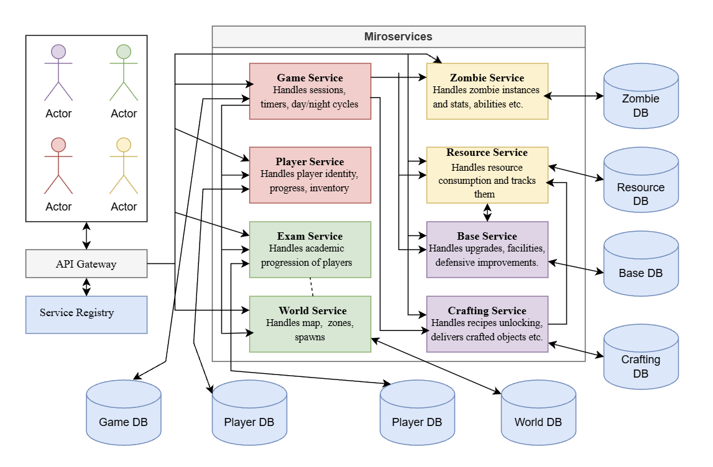

# In Kahoots with the Undead - Communication Contract

This document outlines the communication contracts for the microservices within the **In Kahoots with the Undead** platform — a zombie-survival game set on the FAF campus.

---
## Overview

The platform simulates a campus survival scenario where players gather resources, build up their base, fight off zombies, and pass exams to progress. Each microservice encapsulates a specific domain — player identity, academics, zombies, resources, base management, and crafting. The microservices were designed to ensure modularity, independence, and maintainability.

Microservices are implemented using two technologies:

* **Node.js/TypeScript:** Exam Service, World Service, Zombie Service, Resource Service
* **C#/.NET (ASP.NET Core):** Player Service, Game Service, Base Service, Crafting Service

---
## Team Definition

| Team Member | Services Owned |
|---|---|
| Ceaetchii Andrei | Player Service, Game Service |
| Botnari Maria-Elena | Exam Service, World Service |
| Costin Loredana | Zombie Service, Resource Service |
| Bulat Cristian | Base Service, Crafting Service |

---
## Data Management Strategy

Every service owns a **database** — no service reads or writes another service's tables directly. All cross-service data access happens through the network, using two patterns:

- **Synchronous REST** for data an actor needs immediately to proceed (e.g. Game Service needs zombie stats before it can spawn an encounter).
- **Asynchronous events** (RabbitMQ) for state changes that other services should eventually react to, but that shouldn't stop the initial request (e.g. World Service unlocking a wing doesn't need to block exam grading).

Two rules apply across every state-changing endpoint that moves resources, items, or currency-like values:

- **Idempotency keys.** Any endpoint that deducts something (`POST /api/gather`, `POST /api/spend`, `POST /api/refund`, `POST /api/craft`, trade endpoints) requires an `idempotencyKey`. The receiving service persists a transaction record keyed on it; a repeated call with the same key returns the original result instead of re-applying the effect. This is what makes reconnects and duplicate completion events safe.
- **Sagas for multi-service writes.** Some actions span two databases with no shared transaction (e.g. crafting deducts resources in Resource Service's database *and* adds an item in Player Service's database). These are implemented as a saga: if the second step fails after the first succeeded, the initiating service (Crafting Service, Base Service) issues a compensating call to undo the first step, rather than leaving the two databases inconsistent.

No service is ever a passive shared datastore for another — every read of another domain's data goes through that domain's own API, never a shared schema or cross-service SQL join.

The full communication contract — every endpoint, its payload, and its response — is documented per service below in each service's "Exposed/Consumed API Endpoints" and "Message Queue Events" sections.

---
# Technologies & Communication Patterns
---

| Team | Services | Language & Framework | Database | Communication Patterns | Motivation & Trade-offs |
|---|---|---|---|---|---|
| Ceaetchii Andrei | Player Service, Game Service | C# / ASP.NET Core | PostgreSQL (both services) | REST/HTTP + WebSockets + RabbitMQ Events | C# provides strong typing and asynchronous programming. PostgreSQL ensures data integrity and transactions for player identity, inventory and trades. Game Service uses it as well so both services share one architecture: the same generic repository, migration runner and base entity. Its state is short-lived but still relational (sessions, rosters, timed actions), and one DBMS keeps deployment and the shared compose file simpler. REST is used for request/response communication, WebSockets for real-time updates, and RabbitMQ for asynchronous cross-service events. Trade-off: Redis would fit ephemeral session state better and was the original choice, but running a single database across both services is simpler to operate at this scale. |
| Botnari Maria-Elena | Exam Service, World Service | Node.js/TypeScript (Express) | PostgreSQL | REST + RabbitMQ events | Both services store structured, relational data (exams and attempts for one, rooms and connections for the other), so one language and one database keeps things simple and easy to maintain across both. Trade-off: without EF Core's built-in migration tooling, schema changes to the room graph require more manual discipline to keep consistent. |
| Costin Loredana | Zombie Service, Resource Service | Node.js/TypeScript (Express) | Zombie: MongoDB; Resource: PostgreSQL | Zombie: REST; Resource: REST, idempotency-key-gated | Node's non-blocking I/O fits both I/O-bound services, which wait on DB calls. MongoDB's flexible schema enables rapid Zombie Service iteration without migrations as ability types expand. The correctness-critical Resource Service uses TypeScript and DB transactions to enforce atomic, idempotent balance updates, so duplicate completion events never double-award resources. Trade-off: Node is weaker at CPU-heavy work, but neither service does any, so this cost doesn't apply here. |
| Bulat Cristian | Base Service, Crafting Service | C#/.NET (ASP.NET Core) | PostgreSQL | REST for Base and Crafting Services; RabbitMQ publisher and consumer for both | Both services perform "spend and apply" operations that must not partially succeed. C#'s explicit exception handling and EF Core transactions make atomic, saga-style operations across service calls easier to reason about than a dynamically-typed alternative. Trade-off: more boilerplate than Node for simple CRUD, accepted for the correctness guarantee. |

---
# Architectural Diagram of Microservices Operation



The diagram illustrates the microservices architecture for the **In Kahoots with the Undead** system. Game Service acts as the central service handling the others, making synchronous calls to Player, Exam, World, Zombie, Resource, and Base Service to run a gameplay cycle. Resource Service and Zombie Service never call outward to other microservices. Exam Service and World Service are loosely coupled via asynchronous events — `AchievementUnlocked` (consumed by World Service, Player Service, and Crafting Service) and `ZoneUnlocked` (consumed by Game Service, Base Service, and Crafting Service) — so grading a player's exam doesn't block on procedural map generation. Base Service and Crafting Service each additionally read from and coordinate sagas across several other services to validate and apply their own effects — see the dependency diagram below for the full picture. Crafting Service specifically coordinates a saga across Resource Service and Player Service to atomically consume ingredients and deliver crafted items, and reads from Player, Exam, and World Service to evaluate recipe unlock conditions.

---
## **1. Player Service**

Handles global player identity, progression, and inventory.

### **Owns**
- Player accounts: registration, authentication, profile data.
- Friends and online presence.
- XP totals, levels, and progression.
- The player's inventory: consumables (Coffee, Energy Drinks, Davidan sandwiches) and cosmetics.
- Player-to-player trades, including verifying ownership and transferring items atomically.


### **Exposed API Endpoints**

**`POST /api/auth/register`** *(Consumed by Gateway)*

Creates a new player account.

Payload
```json
{ "username": "faf_survivor", "password": "hunter2", "email": "student@faf.md" }
```

Response
```json
{ "player_id": "p_44", "jwt": "<jwt_token>" }
```

**`POST /api/auth/login`** *(Consumed by Gateway)*

Authenticates a player and returns a JWT.

Payload
```json
{ "username": "faf_survivor", "password": "hunter2" }
```

Response
```json
{ "jwt": "<jwt_token>", "player_id": "p_44" }
```

**`GET /api/players/{player_id}`** *(Consumed by Gateway, Game Service, Crafting Service)*

Retrieves a player's public profile.

Headers: `Authorization: Bearer <jwt>`

Response
```json
{ "player_id": "p_44", "nickname": "faf_survivor", "level": 7, "xp": 1450, "group": "FAF-211" }
```

**`PATCH /api/players/{player_id}/progression`** *(Consumed by Game Service)*

Updates XP after a gameplay event.

Payload
```json
{ "xpDelta": 50, "reason": "cycle_survived" }
```

Response
```json
{ "player_id": "p_44", "xp": 1500, "level": 7, "leveledUp": false }
```

**`GET /api/players/{player_id}/inventory`** *(Consumed by Gateway)*

Retrieves the player's consumables and cosmetics.

Response
```json
{ "items": [ { "itemId": "coffee", "quantity": 3 }, { "itemId": "cosmetic_cap", "quantity": 1 } ] }
```

**`POST /api/players/{player_id}/inventory/items`** *(Consumed by Crafting Service, Base Service)*

Delivers a crafted item or Kiki reward to the player's inventory.

Payload
```json
{ "itemId": "barricade_kit", "quantity": 1, "source": "craft:recipe_wood_metal" }
```

Response
```json
{ "status": "added", "inventorySnapshot": { "barricade_kit": 1 } }
```

**`POST /api/players/{player_id}/achievements`** *(Internal handler, triggered by the `AchievementUnlocked` event)*

Grants an achievement directly (also usable by development team for testing).

Payload
```json
{ "achievementId": "achievementSurvivedMathematics", "grantedBy": "exam:mathematics_complete" }
```

Response
```json
{ "status": "granted" }
```

**`POST /api/trades`** *(Consumed by Gateway)*

Initiates an atomic trade between two players. Verifies both parties own the offered items before committing.

Payload
```json
{
  "idempotencyKey": "trade_772",
  "fromPlayerId": "p_44",
  "toPlayerId": "p_77",
  "offer": [ { "itemId": "coffee", "qty": 2 } ],
  "request": [ { "itemId": "sandwich", "qty": 1 } ]
}
```

Success Response (200 OK)
```json
{ "status": "completed", "tradeId": "trade_772" }
```

Error Response (409 Conflict)
```json
{ "status": "rejected", "reason": "insufficient_items" }
```

### **Message Queue Events**

**SUBSCRIBE `ExamPassed`** *(Published by Exam Service)* — awards the XP reported by an exam attempt.

**SUBSCRIBE `CourseCompleted`** *(Published by Exam Service)* — recorded on the player's progress log.

**SUBSCRIBE `AchievementUnlocked`** *(Published by Exam Service)* — awards the achievement and its XP.

---

## **2. Game Service**

The central real-time gameplay service. Manages sessions, the day/night cycle, timers, and timed player actions.

### **Owns**
- Game sessions/lobbies and session timers.
- The day/night cycle state.
- Timed actions in progress: chopping, scavenging, clearing rooms, barricading, upgrading.
- Live WebSocket delivery of action progress and cycle events to clients.

### **Consumed API Endpoints**

- `POST /api/zombies/spawn`, `POST /api/zombies/{id}/special-action` *(Zombie Service)* — spawn encounters, trigger professor/tourist actions.
- `GET /world/rooms`, `GET /world/rooms/{id}/spawnPoints` *(World Service)* — determine what's available in the current zone.
- `POST /exams/start`, `POST /exams/{attemptId}/submit`, `POST /exams/{attemptId}/abandon` *(Exam Service)* — run exam encounters.
- `POST /api/gather` *(Resource Service)* — apply a completed gathering action.
- `POST /api/base/{playerId}/barricade`, `POST /api/base/{playerId}/facilities` *(Base Service)* — trigger base actions.
- `PATCH /api/players/{playerId}/progression` *(Player Service)* — award XP after a cycle.

### **Exposed API Endpoints**

**`POST /api/sessions/{session_id}/actions`** *(Consumed by Gateway)*

Starts a timed player action.

Payload
```json
{ "playerId": "p_44", "actionType": "scavenge", "targetNodeId": "node_7", "durationSeconds": 300 }
```

Response
```json
{ "actionId": "act_991", "idempotencyKey": "gather_p44_node7_20260908T1200", "status": "in_progress" }
```

**WebSocket Connection**

`wss://api.game/ws/sessions/{session_id}?token=<JWT>` — real-time action progress and cycle events.

**Server → Client Events**
- `action_progress`: `{"type":"action_progress","actionId":"act_991","percent":40}`
- `action_completed`: `{"type":"action_completed","actionId":"act_991","result":{"food":12}}`
- `cycle_changed`: `{"type":"cycle_changed","cycle":"night","zone":"zone_12"}`
- `zombie_encounter`: `{"type":"zombie_encounter","zombieInstanceId":"z_991","zombieType":"professor"}`

### **Message Queue Events**

**SUBSCRIBE `ExamFailed`** *(Published by Exam Service)* — notifies the client of a failed exam attempt.

**SUBSCRIBE `ZoneUnlocked`** *(Published by World Service)* — relayed to clients over WebSocket.

---

## **3. Exam Service**

Owns the definitions of all courses, questions, and the logic to grade them.

### **Owns**
- Exam definitions (questions, options, correct answers, threshold).
- Exam attempts (in progress, abandoned, passed, failed).
- Achievements and unlock conditions.
- Progress (which exams are passed).

### **DockerHub Image**
- **Repository:** [`mariaelenabotnari/exam-service`](https://hub.docker.com/r/mariaelenabotnari/exam-service)
- **Image Tag:** `mariaelenabotnari/exam-service:1.1.0`
- **Default Port:** `3000`

### **Exposed API Endpoints**

**`POST /exams`** *(Consumed by development team)*

Creates a new exam definition.

Payload
```json
{ "courseCategory": "mathematics", "courseName": "Discrete Mathematics", "passingThreshold": 60, "questions": [ { "id": "q1", "text": "Which of the following is a valid proposition?", "options": ["2 plus 2", "It is raining today", "Close the door", "Blue"], "correctOptionId": 1 } ] }
```

Response
```json
{ "examId": "discreteMathematicsExam", "courseCategory": "mathematics", "courseName": "Discrete Mathematics", "passingThreshold": 60, "questions": [ { "id": "q1", "text": "Which of the following is a valid proposition?", "options": ["2 plus 2", "It is raining today", "Close the door", "Blue"] } ] }
```

**`GET /exams?courseCategory={courseCategory}`** *(Consumed by development team, Gateway)*

Lists the exams, optionally filtered by a course category.

Response
```json
[ { "examId": "discreteMathematicsExam", "courseCategory": "mathematics", "courseName": "Discrete Mathematics", "passingThreshold": 60, "questions": [...] } ]
```

**`GET /exams/{examId}`** *(Consumed by Game Service, Gateway)*

Retrieves an exam's questions and options for a player, without exposing the correct answers.

Response
```json
{ "examId": "discreteMathematicsExam", "courseCategory": "mathematics", "courseName": "Discrete Mathematics", "passingThreshold": 60, "questions": [ { "id": "q1", "text": "Which of the following is a valid proposition?", "options": ["2 plus 2", "It is raining today", "Close the door", "Blue"] } ] }
```

**`PUT /exams/{examId}`** *(Consumed by development team)*

Updates an existing exam's questions or passing threshold.

Payload
```json
{ "passingThreshold": 60, "questions": [ { "text": "Updated question text", "options": ["Option A", "Option B", "Option C", "Option D"], "correctOptionId": 2 } ] }
```

Response
```json
{ "updated": true }
```

**`DELETE /exams/{examId}`** *(Consumed by development team)*

Removes an exam definition that is no longer needed.

Response
```json
{ "deleted": true }
```

**`POST /exams/start`** *(Consumed by Game Service)*

Begins a new attempt for a player who encountered a Professor Zombie. Rejects the request if the player already has an attempt in progress or is under a retry cooldown for this exam.

Payload
```json
{ "playerId": "player_123", "examId": "discreteMathematicsExam", "zombieEncounterId": "encounter_789" }
```

Response
```json
{ "attemptId": "attempt_456", "questions": [ { "id": "q1", "text": "Which of the following is a valid proposition?", "options": ["2 plus 2", "It is raining today", "Close the door", "Blue"] } ] }
```

**`POST /exams/{attemptId}/submit`** *(Consumed by Game Service)*

Records submitted answers, grades the attempt, determines pass or fail, and evaluates whether an achievement is now satisfied.

Payload
```json
{ "playerId": "player_123", "examId": "discreteMathematicsExam", "answers": { "q1": 1 } }
```

Response
```json
{ "passed": true, "score": 70 }
```

**`POST /exams/{attemptId}/abandon`** *(Consumed by Game Service)*

Marks an attempt as abandoned, called when a player disconnects or leaves the encounter before submitting.

Payload
```json
{}
```

Response
```json
{ "message": "Exam abandoned successfully" }
```

**`GET /exams/{examId}/retryEligibility?playerId={playerId}`** *(Consumed by Game Service)*

Reports whether the player can retry the specified exam.

Response
```json
{ "canRetry": false, "availableAt": "2026-09-08T10:35:00.000Z" }
```

**`GET /players/{playerId}/progress`** *(Consumed by Gateway, Player Service, Crafting Service)*

Reports the player's status for every exam.

Response
```json
{ "discreteMathematicsExam": "passed", "calculus2Exam": "not_started" }
```

**`GET /players/{playerId}/achievements`** *(Consumed by Gateway, Player Service)*

Reports which achievements a player has unlocked and when.

Response
```json
[ { "achievementId": "achievementSurvivedMathematics", "fullAchievementName": "Achievement, Survived Mathematics", "unlockedAt": "2026-09-08T10:30:00.000Z" } ]
```

### **Message Queue Events**

**PUBLISH `ExamPassedEvent`** *(Consumed by Player Service)*
```json
{ "playerId": "player_123", "courseCategory": "mathematics", "examId": "discreteMathematicsExam", "attemptId": "attempt_456", "grade": 70, "xpAwarded": 100, "timestamp": "2026-09-08T10:30:00Z" }
```

**PUBLISH `ExamFailedEvent`** *(Consumed by Game Service)*
```json
{ "playerId": "player_123", "courseCategory": "mathematics", "examId": "discreteMathematicsExam", "attemptId": "attempt_457", "timestamp": "2026-09-08T10:40:00Z" }
```

**PUBLISH `CourseCompletedEvent`** *(Consumed by Player Service)*
```json
{ "playerId": "player_123", "courseCategory": "mathematics", "timestamp": "2026-09-08T10:45:00Z" }
```

**PUBLISH `AchievementUnlockedEvent`** *(Consumed by World Service, Player Service, Crafting Service)*
```json
{ "playerId": "player_123", "achievementId": "achievementSurvivedMathematics", "fullAchievementName": "Achievement, Survived Mathematics", "xpAwarded": 500, "timestamp": "2026-09-08T10:45:00Z" }
```

---

## **4. World Service**

Owns the persistent physical state of the university.

### **Owns**
- Every zone, every room within each zone, the connections between rooms.
- The type of resource each room produces.
- Every zombie spawn point, including which zombie category is allowed at each.
- Which zones are currently unlocked.

### **DockerHub Image**
- **Repository:** [`mariaelenabotnari/world-service`](https://hub.docker.com/r/mariaelenabotnari/world-service)
- **Image Tag:** `mariaelenabotnari/world-service:1.2.0`
- **Default Port:** `3001`

### **Exposed API Endpoints**

**`POST /world/zones`** *(Consumed by development team)*

Creates a new zone.

Payload
```json
{ "zoneId": "mathematicsWing", "name": "Mathematics Wing", "unlocked": false }
```

Response
```json
{ "zoneId": "mathematicsWing", "name": "Mathematics Wing", "unlocked": false, "unlockedAt": null }
```

**`GET /world/zones`** *(Consumed by Game Service, Gateway, Crafting Service)*

Returns the full list of zones and their unlocked status.

Response
```json
[ { "zoneId": "zoneZero", "name": "Technical University of Moldova Main Campus", "unlocked": true }, { "zoneId": "mathematicsWing", "name": "Mathematics Wing", "unlocked": false } ]
```

**`GET /world/zones/{zoneId}`** *(Consumed by Game Service, Gateway)*

Returns the details of a single zone, including the rooms it contains.

Response
```json
{ "zoneId": "mathematicsWing", "name": "Mathematics Wing", "unlocked": false, "rooms": ["physicsLaboratory", "mathematicsWingLibrary", "mathematicsWingCanteen"] }
```

**`GET /world/zones/{zoneId}/status`** *(Consumed by Gateway, Game Service)*

Reports whether a specific zone is currently unlocked and when it was unlocked.

Response
```json
{ "unlocked": true, "unlockedAt": "2026-09-08T10:45:00.000Z" }
```

**`PUT /world/zones/{zoneId}`** *(Consumed by development team)*

Updates a zone's properties.

Response
```json
{ "zoneId": "mathematicsWing", "name": "Mathematics Wing Updated", "unlocked": true }
```

**`DELETE /world/zones/{zoneId}`** *(Consumed by development team)*

Deletes a zone.

Response
```json
{ "deleted": true }
```

**`POST /world/rooms`** *(Consumed by development team)*

Creates a new room.

Response
```json
{ "roomId": "mathematicsExamHall", "fullRoomName": "Mathematics Exam Hall", "type": "classroom", "zoneId": "zoneZero", "connectsTo": ["mainCorridor"] }
```

**`GET /world/rooms`** *(Consumed by Game Service)*

Returns the list of rooms, optionally filtered by zone and unlocked status.

Query Parameters: `zoneId`, `unlockedOnly`

Response
```json
[ { "roomId": "mathematicsExamHall", "fullRoomName": "Mathematics Exam Hall", "type": "classroom", "zoneId": "zoneZero", "connectsTo": ["mainCorridor"] } ]
```

**`GET /world/rooms/{roomId}`** *(Consumed by Game Service, Base Service)*

Returns the full detail of a single room.

Response
```json
{ "roomId": "mathematicsExamHall", "fullRoomName": "Mathematics Exam Hall", "type": "classroom", "zoneId": "zoneZero", "connectsTo": ["mainCorridor"] }
```

**`PUT /world/rooms/{roomId}`** *(Consumed by development team)*

Updates a room.

Response
```json
{ "roomId": "mathematicsExamHall", "fullRoomName": "Mathematics Exam Hall Updated", "type": "classroom", "zoneId": "zoneZero", "connectsTo": ["mainCorridor"] }
```

**`DELETE /world/rooms/{roomId}`** *(Consumed by development team)*

Deletes a room.

Response
```json
{ "deleted": true }
```

**`GET /world/rooms/{roomId}/connections`** *(Consumed by Game Service)*

Returns the list of rooms directly reachable from a given room.

Response
```json
["mainCorridor"]
```

**`GET /world/rooms/{roomId}/resourceNode`** *(Consumed by Game Service, Resource Service)*

Returns the resource type a given room produces.

Response
```json
{ "resourceType": "metal scraps" }
```

**`GET /world/rooms/{roomId}/spawnPoints`** *(Consumed by Game Service)*

Returns the spawn points available in a room and the zombie category allowed at each.

Response
```json
[
  {
    "spawnPointId": "mathematicsExamHallSpawnOne",
    "roomId": "mathematicsExamHall",
    "zombieCategoryAllowed": "professor",
    "tiedCourseCategory": "mathematics"
  }
]
```

**`GET /world/spawnPoints`** *(Consumed by development team)*

Lists all defined zombie spawn points across campus.

Response
```json
[
  {
    "spawnPointId": "mathematicsExamHallSpawnOne",
    "roomId": "mathematicsExamHall",
    "zombieCategoryAllowed": "professor",
    "tiedCourseCategory": "mathematics"
  }
]
```

**`POST /world/spawnPoints`** *(Consumed by development team)*

Creates a new zombie spawn point tied to a specific room.

Payload
```json
{
  "roomId": "mathematicsExamHall",
  "zombieCategoryAllowed": "professor",
  "tiedCourseCategory": "mathematics"
}
```

Response
```json
{
  "spawnPointId": "spawn_123",
  "roomId": "mathematicsExamHall",
  "zombieCategoryAllowed": "professor",
  "tiedCourseCategory": "mathematics"
}
```

**`GET /world/spawnPoints/{spawnPointId}`** *(Consumed by development team)*

Retrieves details of a specific spawn point.

Response
```json
{
  "spawnPointId": "mathematicsExamHallSpawnOne",
  "roomId": "mathematicsExamHall",
  "zombieCategoryAllowed": "professor",
  "tiedCourseCategory": "mathematics"
}
```

**`PUT /world/spawnPoints/{spawnPointId}`** *(Consumed by development team)*

Updates spawn point parameters (allowed category or tied course category).

Response
```json
{
  "spawnPointId": "mathematicsExamHallSpawnOne",
  "roomId": "mathematicsExamHall",
  "zombieCategoryAllowed": "professor",
  "tiedCourseCategory": "mathematics"
}
```

**`DELETE /world/spawnPoints/{spawnPointId}`** *(Consumed by development team)*

Removes a spawn point configuration.

Response
```json
{
  "deleted": true
}
```

### **Message Queue Events**

**SUBSCRIBE `AchievementUnlockedEvent`** *(Published by Exam Service)*
```json
{ "playerId": "player_123", "achievementId": "achievementSurvivedMathematics", "fullAchievementName": "Achievement, Survived Mathematics", "xpAwarded": 500, "timestamp": "2026-09-08T10:45:00Z" }
```

**PUBLISH `ZoneUnlockedEvent`** *(Consumed by Game Service, Base Service, Crafting Service)*
```json
{ "zoneId": "mathematicsWing", "roomsAdded": ["physicsLaboratory", "mathematicsWingLibrary", "mathematicsWingCanteen"], "timestamp": "2026-09-08T10:45:00Z" }
```

---

## **5. Zombie Service**

Owns the persistent definitions and short-lived instance state of zombies.

### **Owns**
- Zombie type definitions: stats, behavior configuration, special abilities.
- Three categories — Professor Zombies (initiate exams), Tourist Zombies (roam, steal resources/XP) and Infected Zombies (students who can be cured instead of fought, at a resource cost). Other categories may be added later.
- Short-lived zombie instance state during a game cycle (health, spawn point reference, cycle and zone). Instances expire automatically 4 hours after they are spawned.

### **DockerHub Image**
- **Repository:** [`costinloredana/zombie-service`](https://hub.docker.com/r/costinloredana/zombie-service)
- **Image Tag:** `costinloredana/zombie-service:1.1.0`
- **Default Port:** `4001`

### **Consumed API Endpoints**

None. Zombie Service never calls other services; Game Service coordinates anything that follows from a zombie action (e.g. calling Resource Service for a steal or a cure).

### **Exposed API Endpoints**

Every error response has the shape `{ "error": "<code>", "message": "<reason>" }`.

**`GET /health`** *(Consumed by Docker healthcheck)*

Response
```json
{ "status": "ok", "service": "zombie-service" }
```

**`GET /api/zombie-types?category=professor|tourist|infected`** *(Consumed by Game Service)*

Returns zombie type definitions, optionally filtered by category. `curable` and `cureRequirement` are only present on curable (infected) types.

Response
```json
[
  { "typeId": "prof_calc", "category": "professor", "name": "Calculus Professor", "baseHealth": 40, "attackStrength": 5, "moveSpeed": 1.0, "perceptionRadius": 6, "specialAbility": "initiate_exam" },
  { "typeId": "infected_student", "category": "infected", "name": "Infected Student", "baseHealth": 22, "attackStrength": 1, "moveSpeed": 1.2, "perceptionRadius": 7, "specialAbility": "seek_cure", "curable": true, "cureRequirement": { "resourceType": "chemicals", "amount": 2 } }
]
```

400 Bad Request — unknown `category` value:
```json
{ "error": "invalid_zombie_type", "message": "category must be 'professor', 'tourist', or 'infected'" }
```

**`GET /api/zombie-types/{typeId}`** *(Consumed by Game Service)*

Returns a single zombie type (same shape as above), or `404 not_found`.

**`POST /api/zombie-types`** *(Consumed by development team, Admin only)*

Defines a new zombie variant. `typeId` is generated as `<category>_<8 hex chars>`. `curable` and `cureRequirement` are optional, but `cureRequirement` is required when `curable` is `true`.

Payload
```json
{ "category": "tourist", "name": "Exchange Student", "baseHealth": 15, "attackStrength": 1, "moveSpeed": 2.0, "perceptionRadius": 8, "specialAbility": "steal_xp" }
```

Response — 201 Created:

```json
{
  "typeId": "tourist_1a2b3c4d",
  "category": "tourist",
  "name": "Exchange Student",
  "baseHealth": 15,
  "attackStrength": 1,
  "moveSpeed": 2.0,
  "perceptionRadius": 8,
  "specialAbility": "steal_xp"
}
```

400 Bad Request — a required field is missing, `category` is invalid, or `curable: true` comes without a valid `cureRequirement`:
```json
{ "error": "invalid_zombie_type", "message": "Missing fields: baseHealth, moveSpeed" }
```
409 Conflict — a zombie type with the same `name` already exists:
```json
{ "error": "zombie_type_exists", "message": "A zombie type with this name already exists." }
```

**`PUT /api/zombie-types/{typeId}`** *(Consumed by development team, Admin only)*

Partially updates a zombie type; only the fields sent are changed, validated with the same rules as create.

Payload
```json
{ "baseHealth": 25 }
```

Returns `200 OK` with the updated type, `400 invalid_zombie_type`, or `404 not_found`.

**`DELETE /api/zombie-types/{typeId}`** *(Consumed by development team, Admin only)*

Returns `204 No Content`, or `404 not_found`.

**`POST /api/zombies/spawn`** *(Consumed by Game Service)*

Instantiates zombies at cycle start. For each instance a category is picked using `typeWeights` (keys `professor`, `tourist` or `infected`; non-negative numbers, at least one above 0), then a random zombie type from that category. Instances start with the type's `baseHealth`.

Payload
```json
{ "cycleId": "cyc_884", "worldZoneId": "zone_12", "spawnCount": 5, "typeWeights": { "professor": 0.3, "tourist": 0.7 } }
```

Response — 201 Created:
```json
{
  "zombies": [
    { "instanceId": "z_a3cecfcc", "typeId": "prof_calc", "category": "professor", "health": 40, "spawnPoint": "zone_12_spawn_1", "cycleId": "cyc_884", "worldZoneId": "zone_12", "createdAt": "2026-09-23T15:15:45.963Z" }
  ]
}
```

400 Bad Request — a field is missing or invalid, or a weighted category has no zombie types yet:
```json
{ "error": "invalid_spawn_request", "message": "spawnCount must be a positive integer." }
```

**`POST /api/zombies/{instance_id}/special-action`** *(Consumed by Game Service)*

Triggers a zombie's special action against a player. The response always carries `actionType` (the type's `specialAbility`) and `targetPlayerId`, plus one category-specific field:

| Category | Extra field | Meaning for Game Service |
|---|---|---|
| `professor` | `suggestedExamCategory` | Start an exam encounter in that course category via Exam Service |
| `tourist` | `suggestedAmount` | Resources/XP to steal from the player via Resource Service |
| `infected` | `cureRequirement` | What the player must spend (via Resource Service) to cure the zombie |

Payload
```json
{ "targetPlayerId": "p_44" }
```

Response — 200 OK (one example per category):
```json
{ "actionType": "initiate_exam", "targetPlayerId": "p_44", "suggestedExamCategory": "Programming" }
```
```json
{ "actionType": "steal_resource", "targetPlayerId": "p_44", "suggestedAmount": { "food": 4 } }
```
```json
{ "actionType": "seek_cure", "targetPlayerId": "p_44", "cureRequirement": { "resourceType": "chemicals", "amount": 2 } }
```

400 Bad Request — `targetPlayerId` missing:
```json
{ "error": "invalid_special_action_request", "message": "targetPlayerId is required." }
```
404 Not Found — the instance was never spawned, has expired, or its zombie type was deleted:
```json
{ "error": "not_found", "message": "Zombie instance not found. It may not have been spawned yet." }
```

---

## **6. Resource Service**

Owns the university's resource economy independently from the physical map.

### **Owns**
- Resource type definitions. The seeded ids are `wood`, `metal`, `paper`, `food`, `chemicals` and `electronics`; new ids are the lowercase name with spaces replaced by `_` (e.g. `"Chemical Waste"` → `chemical_waste`).
- Player resource inventories/balances.
- Resource node state (how much is available at a given gatherable location).
- The full transaction/idempotency ledger for every resource change.

### **DockerHub Image**
- **Repository:** [`costinloredana/resource-service`](https://hub.docker.com/r/costinloredana/resource-service)
- **Image Tag:** `costinloredana/resource-service:1.1.0`
- **Default Port:** `4002`

### **Consumed API Endpoints**

None. Resource Service never calls other services. Node state is stored in its own database; Game Service reads which node a room has from World Service (`GET /world/rooms/{roomId}/resourceNode`) and passes that `nodeId` to `POST /api/gather`.

### **Exposed API Endpoints**

Errors use the shape `{ "error": "<code>", "message": "<reason>" }` (`invalid_body` / `invalid_resource_type` for 400, `not_found` for 404, `resource_type_exists` / `inventory_exists` for 409). The only exception is the 402 from `/api/spend`, shown below.

**`GET /health`** *(Consumed by Docker healthcheck)*

Response
```json
{ "status": "ok", "service": "resource-service" }
```

**`GET /api/resource-types`**, **`GET /api/resource-types/{id}`** *(Consumed by development team and any service that needs resource metadata)*

Returns all resource types (sorted by name) or a single one (`404 not_found` if missing).

Response
```json
[ { "resourceTypeId": "food", "name": "Food", "description": "Gathered from canteens, consumed by Kiki and players.", "stackable": true } ]
```

**`POST /api/resource-types`**, **`PUT /api/resource-types/{id}`**, **`DELETE /api/resource-types/{id}`** *(Consumed by development team, Admin only)*

Creates, partially updates, or deletes a resource type. On create, `name` (string) and `stackable` (boolean) are required and `description` is optional.

Payload
```json
{ "name": "Metal", "description": "Used in barricades and crafting.", "stackable": true }
```

Response — 201 Created:
```json
{ "resourceTypeId": "metal", "name": "Metal", "description": "Used in barricades and crafting.", "stackable": true }
```

Create returns `400 invalid_resource_type` for a missing field and `409 resource_type_exists` for a duplicate. Update returns `200`, delete returns `204`, and both return `404 not_found` for an unknown id.

**`POST /api/inventory/{player_id}`** *(Consumed by Game Service)*

Creates an empty inventory. No body. Returns `201` with `{ "playerId": "p_44", "resources": {} }`, or `409 inventory_exists`. Optional, because the transaction endpoints below also create the inventory on first use.

**`GET /api/inventory/{player_id}`** *(Consumed by Gateway, Base Service, Crafting Service)*

Returns a player's current resource balances.

Response
```json
{ "playerId": "p_44", "resources": { "wood": 10, "metal": 4, "paper": 6, "food": 42 } }
```

404 Not Found — the player has no inventory yet.

**`PUT /api/inventory/{player_id}`**, **`DELETE /api/inventory/{player_id}`** *(Consumed by development team, Admin only)*

`PUT` overwrites all balances (creating the inventory if needed) and isn't idempotency-gated, so gameplay must use `gather`/`spend`/`refund` instead. `DELETE` returns `204`, or `404 not_found`.

Payload (PUT)
```json
{ "resources": { "food": 10, "wood": 3 } }
```

**`POST /api/gather`** *(Consumed by Game Service — idempotent)*

Applies a resource change when a timed gathering action completes. `nodeId` is optional; when it names a known node, that node's `quantityAvailable` goes down by `amount` (never below 0).

Payload
```json
{ "idempotencyKey": "gather_p44_node7_20260908T1200", "playerId": "p_44", "nodeId": "node_7", "resourceType": "food", "amount": 12 }
```

Success Response (200 OK)
```json
{ "status": "applied", "newBalance": { "food": 42 } }
```

Duplicate Response (200 OK)
```json
{ "status": "already_applied", "newBalance": { "food": 42 } }
```

400 Bad Request — a required field is missing or `amount` isn't positive:
```json
{ "error": "invalid_body", "message": "amount must be a positive number." }
```

**`POST /api/spend`** *(Consumed by Base Service, Crafting Service — idempotent)*

Deducts resources for barricading, upgrades, crafting, or feeding Kiki. Either every cost is deducted or none is: the player's row is locked and every balance is checked first.

Payload
```json
{ "idempotencyKey": "spend_p44_barricade_room9", "playerId": "p_44", "reason": "barricade", "costs": [ { "resourceType": "wood", "amount": 5 }, { "resourceType": "metal", "amount": 2 } ] }
```

Success Response (200 OK)
```json
{ "status": "applied", "newBalance": { "wood": 5, "metal": 2 } }
```

Duplicate Response (200 OK)
```json
{ "status": "already_applied", "newBalance": { "wood": 5, "metal": 2 } }
```

Error Response (402 Payment Required) — nothing is deducted and the key isn't stored, so the same key can be retried later:
```json
{ "status": "rejected_insufficient", "missing": { "wood": 2 } }
```

400 Bad Request — missing `idempotencyKey`/`playerId`/`reason`, or `costs` isn't a non-empty array of `{ resourceType, amount }` with positive amounts.

**`GET /api/nodes/{node_id}`** *(Consumed by Game Service)*

Returns remaining gatherable quantity at a node.

Response
```json
{ "nodeId": "node_7", "resourceType": "food", "quantityAvailable": 30, "respawnRate": "5/hour" }
```

404 Not Found — unknown node.

**`POST /api/refund`** *(Consumed by Base Service, Crafting Service — idempotent)*

Returns previously spent resources when a multi-service operation cannot be completed.

This endpoint is used as the compensation step of a saga. The refund is idempotent so that retrying the compensation cannot return the same resources more than once. The payload has the same shape and validation as `/api/spend`.

Payload

```json
{
  "idempotencyKey": "refund_craft_p44_barricadekit_001", "playerId": "p_44", "reason": "craft_rollback",
  "costs": [
    { "resourceType": "wood", "amount": 3 },
    { "resourceType": "metal", "amount": 1 }
  ]
}
```

Success Response (200 OK)

```json
{
  "status": "refunded",
  "newBalance": { "wood": 13, "metal": 5 }
}
```
Duplicate Response (200 OK)

```json
{
  "status": "already_refunded",
  "newBalance": { "wood": 13, "metal": 5 }
}
```

---

## **7. Base Service**

Responsible for the player's survival base, initially represented by the FAF Cab room.

### **Owns**
- Base upgrades, barricades, facilities, and defensive improvements, tracked separately from World Service's campus geography.
- The rooms claimed into the base, their barricade levels, and the aggregate defense rating.
- Unlocked storage capacity and homeroom decorations.
- Kiki's interaction state and reward outcomes.
- The transaction ledger keyed on the caller's idempotency key.

### **DockerHub Image**
- **Repository:** [`cristi150404/base-service`](https://hub.docker.com/r/cristi150404/base-service)
- **Image Tag:** `cristi150404/base-service:1.0.0`
- **Default Port:** `5003`

### **Consumed API Endpoints**

- `GET /world/rooms/{roomId}` *(World Service)* — confirms a room exists and its zone is unlocked.
- `POST /api/spend` *(Resource Service)* — deducts resources before applying a barricade, facility upgrade, decoration, or Kiki feeding.
- `POST /api/refund` *(Resource Service)* — returns the resources if the effect cannot be applied.
- `POST /api/players/{player_id}/inventory/items` *(Player Service)* — delivers a Kiki reward to the player's inventory.

Every state-changing endpoint spends first, then applies the effect in one database transaction. If that fails, Base Service refunds the resources rather than leaving the player having paid for nothing.

### **Exposed API Endpoints**

**`GET /api/base/{player_id}`** *(Consumed by Gateway, Game Service)*

Returns the current state of a player's base, including the defense rating used for night raids and the storage capacity used to cap a gather.

Response
```json
{
  "playerId": "p_44",
  "defenseRating": 34,
  "storageCapacity": 250,
  "moraleBonus": 3,
  "rooms": [ { "roomId": "faf_cab", "barricadeLevel": 2 } ],
  "facilities": [ { "facilityType": "storage", "level": 2 } ],
  "decorations": [ { "decorationId": "dec_01", "itemId": "faf_poster" } ],
  "kiki": { "mood": "content", "cooldownUntil": "2026-09-08T22:00:00Z" }
}
```

**`POST /api/base/{player_id}/rooms`** *(Consumed by Gateway — idempotent)*

Claims a campus room into the player's base, after checking with World Service that its zone is unlocked.

Payload
```json
{ "idempotencyKey": "claim_p44_mainCorridor_001", "roomId": "mainCorridor" }
```

Response
```json
{ "roomId": "mainCorridor", "barricadeLevel": 0 }
```

**`POST /api/base/{player_id}/barricade`** *(Consumed by Game Service — idempotent)*

Spends resources via Resource Service, then raises the room's barricade by one level.

Payload
```json
{ "idempotencyKey": "barricade_p44_faf_cab_001", "roomId": "faf_cab" }
```

Success Response (200 OK)
```json
{ "roomId": "faf_cab", "barricadeLevel": 3, "defenseRating": 34, "resourcesSpent": { "wood": 5, "metal": 2 } }
```

Error Response (402 Payment Required)
```json
{ "status": "rejected_insufficient", "missing": { "wood": 2 } }
```

Error Response (500, compensated)
```json
{ "status": "rolled_back", "reason": "effect_not_applied", "resourcesRefunded": true }
```

**`POST /api/base/{player_id}/facilities`** *(Consumed by Game Service — idempotent)*

Unlocks or upgrades a facility by one level; upgrading `storage` also raises the storage capacity.

Payload
```json
{ "idempotencyKey": "facility_p44_storage_001", "facilityType": "storage" }
```

Response
```json
{ "facilityType": "storage", "level": 2, "storageCapacity": 250, "resourcesSpent": { "wood": 8 } }
```

**`POST /api/base/{player_id}/decorations`** *(Consumed by Gateway — idempotent)*

Places a decoration in a claimed room, adding a small morale bonus.

Payload
```json
{ "idempotencyKey": "decorate_p44_faf_poster_001", "itemId": "faf_poster", "roomId": "faf_cab" }
```

Response
```json
{ "decorationId": "dec_01", "moraleBonus": 3, "resourcesSpent": { "paper": 2 } }
```

**`POST /api/base/{player_id}/kiki/interact`** *(Consumed by Gateway — idempotent)*

Feeds Kiki and returns a random booster reward, delivered through Player Service. The reward is rolled once and stored, so a retry returns the same one.

Payload
```json
{ "idempotencyKey": "kiki_p44_001" }
```

Success Response (200 OK)
```json
{ "mood": "happy", "reward": { "itemId": "energy_booster", "quantity": 1 }, "resourcesSpent": { "food": 5 }, "cooldownUntil": "2026-09-08T22:00:00Z" }
```

Error Response (422 Unprocessable Entity)
```json
{ "status": "rejected", "reason": "kiki_on_cooldown" }
```

**`GET /api/base/{player_id}/transactions/{idempotencyKey}`** *(Consumed by Gateway)*

Reports the outcome of a base action, so a client that lost the response can check it instead of retrying blindly.

Response
```json
{ "idempotencyKey": "barricade_p44_faf_cab_001", "action": "barricade", "status": "completed" }
```

### **Message Queue Events**

**PUBLISH `BaseDefenseChanged`** *(Consumed by Game Service)* — reports the new defense rating whenever a barricade or facility changes it.
```json
{ "playerId": "p_44", "defenseRating": 34, "timestamp": "2026-09-08T20:14:00Z" }
```

**SUBSCRIBE `ZoneUnlocked`** *(Published by World Service)* — records the rooms of a newly unlocked wing as claimable.

---

## **8. Crafting Service**

Allows players to combine resources into useful survival equipment.

### **Owns**
- Recipe definitions and unlock conditions: Wood + Metal → Barricade Kit, Paper + Metal → Improvised Weapon, Food + Chemicals → Energy Booster, Metal + Electronics → Zombie Detector, Paper + Wood → Exam Cheat Sheet.
- Which recipes each player has unlocked.
- The craft transaction/saga state for each craft attempt.

### **DockerHub Image**
- **Repository:** [`cristi150404/crafting-service`](https://hub.docker.com/r/cristi150404/crafting-service)
- **Image Tag:** `cristi150404/crafting-service:1.0.0`
- **Default Port:** `5004`

### **Consumed API Endpoints**

- `POST /api/spend` *(Resource Service)* — consumes recipe ingredients.
- `POST /api/refund` *(Resource Service)* — returns the ingredients if delivery fails.
- `POST /api/players/{player_id}/inventory/items` *(Player Service)* — delivers the crafted item.
- `GET /api/players/{player_id}` *(Player Service)* — reads the player's level.
- `GET /players/{playerId}/progress` *(Exam Service)* — reads passed exams.
- `GET /world/map` *(World Service)* — reads unlocked zones.

A recipe can be gated on a player level, a passed exam, an unlocked zone, or a discovered resource, which is why this service reads from four others. If delivery fails after the ingredients were consumed, Crafting Service refunds them — this is the saga's rollback path.

### **Exposed API Endpoints**

**`GET /api/recipes`** *(Consumed by Gateway)*

Returns the recipes for a player, each marked unlocked or locked. `playerId` is required, since unlock conditions are evaluated per player.

Query Parameters: `playerId`, `includeLocked`

Response
```json
{
  "playerId": "p_44",
  "recipes": [
    { "recipeId": "recipe_wood_metal", "name": "Barricade Kit", "ingredients": [ { "resourceType": "wood", "amount": 3 }, { "resourceType": "metal", "amount": 1 } ], "output": "barricade_kit", "unlockCondition": null, "unlocked": true },
    { "recipeId": "recipe_metal_electronics", "name": "Zombie Detector", "ingredients": [ { "resourceType": "metal", "amount": 3 }, { "resourceType": "electronics", "amount": 2 } ], "output": "zombie_detector", "unlockCondition": { "type": "playerLevel", "minLevel": 5 }, "unlocked": false }
  ]
}
```

**`GET /api/recipes/{recipeId}/eligibility`** *(Consumed by Gateway)*

Reports whether a player can craft a recipe and, if not, which condition or material is missing.

Query Parameters: `playerId`

Response
```json
{ "recipeId": "recipe_metal_electronics", "unlocked": false, "unsatisfied": [ { "type": "playerLevel", "minLevel": 5, "actual": 3 } ], "missingMaterials": { "electronics": 1 } }
```

**`POST /api/recipes`** *(Consumed by development team for content seeding)*

Defines a new recipe and its unlock condition.

Payload
```json
{ "recipeId": "recipe_food_chemicals", "name": "Energy Booster", "ingredients": [ { "resourceType": "food", "amount": 4 }, { "resourceType": "chemicals", "amount": 1 } ], "output": "energy_booster", "unlockCondition": { "type": "resourceDiscovered", "resourceType": "chemicals" } }
```

Response
```json
{ "recipeId": "recipe_food_chemicals", "created": true }
```

**`POST /api/craft`** *(Consumed by Gateway — idempotent)*

Validates the unlock condition and ingredients, consumes them via Resource Service, and delivers the result via Player Service.

Payload
```json
{ "idempotencyKey": "craft_p44_barricadekit_001", "playerId": "p_44", "recipeId": "recipe_wood_metal" }
```

Success Response (200 OK)
```json
{ "craftId": "craft_881", "status": "completed", "itemDelivered": "barricade_kit" }
```

Error Response (402 Payment Required)
```json
{ "status": "rejected_insufficient_materials", "missing": { "metal": 1 } }
```

Error Response (422 Unprocessable Entity)
```json
{ "status": "rejected", "reason": "recipe_locked" }
```

Error Response (500, compensated)
```json
{ "status": "rolled_back", "reason": "inventory_delivery_failed", "resourcesRefunded": true }
```

**`GET /api/crafts/{craftId}`** *(Consumed by Gateway)*

Reports the state of a craft attempt.

Response
```json
{ "craftId": "craft_881", "playerId": "p_44", "recipeId": "recipe_wood_metal", "status": "completed" }
```

### **Message Queue Events**

**SUBSCRIBE `AchievementUnlocked`** *(Published by Exam Service)* — re-evaluates the player's locked recipes.

**SUBSCRIBE `ZoneUnlocked`** *(Published by World Service)* — re-evaluates recipes gated on an unlocked zone.

**PUBLISH `RecipeUnlocked`** *(Consumed by Game Service)* — reports a recipe that has just become available to a player.
```json
{ "playerId": "p_44", "recipeId": "recipe_metal_electronics", "name": "Zombie Detector", "timestamp": "2026-09-08T20:45:00Z" }
```

---

## Branch Structure

### Main Branches
- **`main`** - Production-ready code, always deployable
- **`development`** - Integration branch for features, staging environment

### Branch Protection Rules
- **Approvals Required**: 1 reviewer minimum
- **Dismiss Stale Reviews**: Enabled (reviews are dismissed when new commits are pushed)
- **Branch must be up to date**: Required before merging

## Branch Naming Convention

We follow a standardized naming pattern for all feature branches:

```
type/short-description-issueID
```

### Branch Types
| Prefix | Purpose | Example |
|--------|---------|---------|
| `feature/` | New functionality | `feature/zombie-spawn-logic-23` |
| `bugfix/` | Bug fixes | `bugfix/resource-double-award-15` |
| `hotfix/` | Critical production fixes | `hotfix/server-crash-18` |
| `refactor/` | Code restructuring | `refactor/resource-transaction-45` |
| `docs/` | Documentation updates | `docs/api-documentation-12` |
| `chore/` | Maintenance tasks | `chore/dependency-updates-8` |

### Naming Guidelines
- Use lowercase letters and hyphens
- Keep descriptions concise but descriptive
- Always include the related issue number
- Use present tense for actions

## Merging Strategy

**Strategy**: Squash and Merge

### Benefits
- Clean, linear commit history
- Combines all commits from a feature branch into a single commit
- Easier to track features and revert if necessary
- Reduces noise in the main branch history

### Process
1. Create feature branch from `development`
2. Make commits with clear, descriptive messages
3. Open Pull Request to `development`
4. After approval, squash and merge
5. Delete feature branch after merge

## Pull Request Requirements

Every PR must include a clear description, a linked issue, and testing steps. UI changes need screenshots.

### PR Template

Located at `.github/PULL_REQUEST_TEMPLATE.md`:

```markdown
## What does this PR do?
Brief description and related issue (Closes #XX)

## Changes Made
- Change 1
- Change 2

## Type of Change
- [ ] Bug fix
- [ ] New feature
- [ ] Breaking change
- [ ] Documentation

```

## Testing Standards

### Current Requirements
- All new functions should have corresponding tests
- Run existing tests before submitting PR: `npm test` (Node) or `dotnet test` (C#)
- Manual testing steps must be documented in PR
- Critical features (Resource Service transactions, Crafting sagas) require integration testing

### Future Automation
- GitHub Actions will be configured for automatic testing
- All PRs must pass automated tests before merging
- Code coverage reports will be generated

### Testing Requirements
- Unit test coverage minimum: **70%**

## Versioning Strategy

We follow **Semantic Versioning (SemVer)**: `MAJOR.MINOR.PATCH`

### Version Types
- **MAJOR** (e.g., 1.0.0 → 2.0.0): Breaking changes that require user action
- **MINOR** (e.g., 1.0.0 → 1.1.0): New features that are backward compatible
- **PATCH** (e.g., 1.0.0 → 1.0.1): Bug fixes and small improvements

### Release Process
1. Update version in `package.json` (Node) or `.csproj` (C#)
2. Create release notes documenting changes
3. Tag release in GitHub: `git tag v1.0.0`
4. Create GitHub Release with changelog
5. Deploy to staging, then production

### Release Notes Format
```markdown
## [1.2.0] - 2026-09-08

### Added
- Tourist Zombie resource-steal mechanic
- Crafting saga rollback logic

### Changed
- Improved exam grading response time
- Updated Resource Service idempotency handling

### Fixed
- Duplicate resource award on client reconnect
- Base barricade level not persisting

### Security
- Updated dependencies with security patches
```

## Code Review Guidelines

### For Reviewers
- Check code quality and adherence to standards
- Verify functionality matches requirements
- Test the changes locally when possible
- Provide constructive feedback
- Approve only when confident in the changes

### For Authors
- Respond to feedback promptly and professionally
- Make requested changes in separate commits
- Re-request review after addressing feedback
- Keep PRs focused and reasonably sized

## Workflow Summary

1. **Create Issue**: Document the feature/bug with clear requirements
2. **Create Branch**: Use proper naming convention from `development`
3. **Develop**: Make commits with clear, descriptive messages
4. **Test**: Verify functionality and run existing tests
5. **Create PR**: Follow template and provide complete information
6. **Review**: Address feedback and get required approvals
7. **Merge**: Squash and merge to `development`
8. **Deploy**: Regular releases from `development` to `main`

## Tools & Resources

- **GitHub Desktop**: For GUI-based Git operations
- **VS Code / Visual Studio**: Recommended IDEs with Git integration
- **GitHub CLI**: For command-line operations
- **Conventional Commits**: For consistent commit messages

## Team Responsibilities

- **All Team Members**: Follow branching strategy and PR requirements
- **Reviewers**: Provide timely, constructive feedback
- **Project Lead**: Manage releases and resolve conflicts
- **QA**: Test major features before production deployment
---

## Deployment & Database Seeding

### Services on DockerHub

The microservices are containerized and published on DockerHub:

| Service | DockerHub Repository | Image Tag | Default Port | Description |
|---|---|---|---|---|
| **Exam Service** | [`mariaelenabotnari/exam-service`](https://hub.docker.com/r/mariaelenabotnari/exam-service) | `mariaelenabotnari/exam-service:1.1.0` | `3000` | Academic progression, exams, and achievements |
| **World Service** | [`mariaelenabotnari/world-service`](https://hub.docker.com/r/mariaelenabotnari/world-service) | `mariaelenabotnari/world-service:1.2.0` | `3001` | Physical campus layout, rooms, zones, and spawn points |
| **Player Service** | [`andrei045/player-service`](https://hub.docker.com/r/andrei045/player-service) | `andrei045/player-service:1.1.0` | `3002` | Player identity, progression, inventory, and trades |
| **Game Service** | [`andrei045/game-service`](https://hub.docker.com/r/andrei045/game-service) | `andrei045/game-service:1.1.1` | `3003` | Game sessions, day/night cycle, and timed player actions |
| **Zombie Service** | [`costinloredana/zombie-service`](https://hub.docker.com/r/costinloredana/zombie-service) | `costinloredana/zombie-service:1.1.0` | `4001` | Zombie type definitions, spawned instances, and special actions |
| **Resource Service** | [`costinloredana/resource-service`](https://hub.docker.com/r/costinloredana/resource-service) | `costinloredana/resource-service:1.1.0` | `4002` | Resource types, player balances, nodes, and idempotent transactions |
| **Base Service** | [`cristi150404/base-service`](https://hub.docker.com/r/cristi150404/base-service) | `cristi150404/base-service:1.0.0` | `5003` | Player bases, barricades, facilities, and decorations |
| **Crafting Service** | [`cristi150404/crafting-service`](https://hub.docker.com/r/cristi150404/crafting-service) | `cristi150404/crafting-service:1.0.0` | `5004` | Recipes, unlock conditions, and crafting sagas |

---

### System Requirements & Prerequisites

To run these services locally via Docker Compose, ensure the host machine meets the following requirements:

1. **Docker Engine & Docker Compose**:
   - Docker Engine `20.10.0+` or Docker Desktop `4.0.0+`
   - Docker Compose `v2.0.0+`
2. **Available Host Ports**:
   - `3000` — Exam Service HTTP API
   - `3001` — World Service HTTP API
   - `5433` — Exam PostgreSQL Database (`exam-db`)
   - `5434` — World PostgreSQL Database (`world-db`)
   - `3002` — Player Service HTTP API
   - `3003` — Game Service HTTP API
   - `5435` — Player PostgreSQL Database (`player-db`)
   - `5436` — Game PostgreSQL Database (`game-db`)
   - `4001` — Zombie Service HTTP API
   - `4002` — Resource Service HTTP API
   - `5437` — Resource PostgreSQL Database (`resource-db`)
   - `27017` — Zombie MongoDB Database (`zombie-db`)
   - `5003` — Base Service HTTP API
   - `5004` — Crafting Service HTTP API
   - `5438` — Base PostgreSQL Database (`base-db`)
   - `5439` — Crafting PostgreSQL Database (`crafting-db`)
3. **Resource Allocations**:
   - At least 3 GB of RAM available for Docker (sixteen containers, including one MongoDB instance)
   - 3 GB free disk space for Docker images and the PostgreSQL/MongoDB data volumes
4. **Environment Configuration**:
   - Self-contained in `docker-compose.yml`; no manual `.env` file setup is required to start up the stack.

#### Zombie Service & Resource Service images

Both images are multi-stage Node.js 20 builds that run as the non-root `node` user and ship a `HEALTHCHECK` against `GET /health`. Each one only needs its own database; neither calls another microservice, so they can be started on their own.

| | Zombie Service | Resource Service |
|---|---|---|
| **Image** | `costinloredana/zombie-service:1.1.0` (`node:20-alpine`) | `costinloredana/resource-service:1.1.0` (`node:20-slim` + OpenSSL for Prisma) |
| **Database** | MongoDB 8 (`mongo:8`) | PostgreSQL 17 (`postgres:17-alpine`) |
| **Required env** | `MONGO_URI`, e.g. `mongodb://zombie-db:27017/zombie_db` | `POSTGRES_HOST`, `POSTGRES_PORT`, `POSTGRES_USER`, `POSTGRES_PASSWORD`, `POSTGRES_DB`, or a single `DATABASE_URL` that takes precedence over them |
| **Optional env** | `PORT` (default `4001`) | `PORT` (default `4002`) |
| **Schema setup** | None, Mongoose creates the collections and the 4-hour TTL index on instances | Automatic, tables are created with `CREATE TABLE IF NOT EXISTS` on startup (no `prisma migrate` step) |
| **Seed** | `npm run db:seed`: 3 zombie types | `npm run db:seed`: 5 resource types and 4 nodes |

The service exits on startup if its database is unreachable, so start it only after the database is healthy (the team compose file does this with `depends_on: condition: service_healthy`). To run one on its own, outside the team compose file:

```bash

# Zombie Service
docker run -d --name zombie-db --network kahoots-net mongo:8
docker run -d --name zombie-service --network kahoots-net -p 4001:4001   -e MONGO_URI=mongodb://zombie-db:27017/zombie_db   costinloredana/zombie-service:1.1.0

# Resource Service
docker run -d --name resource-db --network kahoots-net   -e POSTGRES_USER=postgres -e POSTGRES_PASSWORD=postgres -e POSTGRES_DB=resource_db postgres:17-alpine
docker run -d --name resource-service --network kahoots-net -p 4002:4002   -e POSTGRES_HOST=resource-db -e POSTGRES_PORT=5432 -e POSTGRES_USER=postgres   -e POSTGRES_PASSWORD=postgres -e POSTGRES_DB=resource_db   costinloredana/resource-service:1.1.0
```

If a container exits right away, the database probably wasn't ready yet. Wait a few seconds and run `docker start zombie-service` or `docker start resource-service`.

---

### Step-by-Step Execution Guide

#### 1. Start the Microservices & Databases
From the repository root, start all sixteen containers in detached mode:
```bash
docker compose up -d
```
Docker Compose will automatically pull the images from DockerHub, initialize the database containers (`exam-db` on 5433, `world-db` on 5434, `player-db` on 5435, `game-db` on 5436, `resource-db` on 5437, `zombie-db` on 27017, `base-db` on 5438, `crafting-db` on 5439), perform healthchecks, and launch `exam-service`, `world-service`, `player-service`, `game-service`, `zombie-service`, `resource-service`, `base-service` and `crafting-service`.

To check container health and status:
```bash
docker compose ps
```

#### 2. Run Database Seeding
Exam, World, Zombie and Resource Service include idempotent database seed scripts. Run them inside the containers using `docker compose exec`:

##### Seed the Exam Service Database
```bash
docker compose exec exam-service npm run db:seed
```
- **Execution & Idempotency:** Connects to `exam_db` and checks if the `exams` table contains any records. If records already exist, seeding is safely skipped without altering existing data.
- **Data Seeded:** If empty, seeds **15 course exams** across 5 categories (Mathematics, Programming, Systems & Hardware, Databases, Law) with 10 questions each, plus **6 achievements** for course category completion and graduation.

##### Seed the World Service Database
```bash
docker compose exec world-service npm run db:seed
```
- **Execution & Idempotency:** Connects to `world_db` and checks if the `zones` table contains any records. If records already exist, seeding is safely skipped without duplicating records.
- **Data Seeded:** If empty, seeds:
  - **7 Zones:** `zoneZero` (`unlocked: true`) and 6 wing/hall zones (`unlocked: false`).
  - **30 Rooms:** campus rooms with connection topology (student base room, main corridor, exam halls, classrooms, laboratories, libraries, canteens, diploma hall).
  - **54 Spawn Points:** generated programmatically in a loop (10 Professor spawn points in exam halls with tied course categories, and 44 Tourist spawn points in classrooms, labs, libraries, and canteens; safe rooms contain 0 spawns).

##### Seed the Base and Crafting Service Databases
Both databases are seeded by one script from the repository root, after the containers are healthy:
```bash
./db-scripts/seed-base-crafting.sh
```
- **Execution & Idempotency:** Waits for `base-service` (`:5003/health`) and `crafting-service` (`:5004/health`) so the services have created their tables, then pipes `db-scripts/base-service/seed.sql` and `db-scripts/crafting-service/seed.sql` into the two databases. Each script checks whether its main table already holds rows and skips itself if so, leaving existing data untouched.
- **Data Seeded:** If empty, seeds:
  - **Base Service:** 3 player bases with claimed rooms, barricade levels, facilities and decorations, plus 2 completed transactions in the idempotency ledger.
  - **Crafting Service:** the **5 contract recipes** with their ingredients, one per unlock condition type (none, `zoneUnlocked`, `resourceDiscovered`, `playerLevel`, `examPassed`), 2 known players with their unlocks, and 1 completed craft.

##### Seed the Zombie Service Database
```bash
docker compose exec zombie-service npm run db:seed
```
- **Execution & Idempotency:** Connects to `zombie_db` and checks if the `zombieTypes` collection contains any documents. If it does, seeding is skipped.
- **Data Seeded:** If empty, seeds **3 zombie types**: `prof_calc` (professor, `initiate_exam`), `tourist_backpacker` (tourist, `steal_resource`) and `infected_student` (infected, `seek_cure`, curable with 2 × `chemicals`).

##### Seed the Resource Service Database
```bash
docker compose exec resource-service npm run db:seed
```
- **Execution & Idempotency:** Connects to `resource_db` and checks the `resource_types` and `resource_nodes` tables separately. Each one is only seeded if it's empty.
- **Data Seeded:** Inserts any missing defaults: **6 resource types** (`wood`, `metal`, `food`, `paper`, `chemicals`, `electronics`) and **6 resource nodes** (`node_1` to `node_6`). Existing rows are never changed.

#### 3. Verify Endpoints
Once seeded, you can verify the persistent data via HTTP requests (Postman, browser, or curl):

```bash
# Verify Exam Service
curl -s http://localhost:3000/exams

# Verify World Service Zones
curl -s http://localhost:3001/zones

# Verify World Service Rooms
curl -s http://localhost:3001/rooms

# Verify Base Service
curl -s http://localhost:5003/api/base

# Verify Crafting Service
curl -s http://localhost:5004/api/recipes/definitions

# Verify World Service Spawn Points
curl -s http://localhost:3001/spawnPoints
```

# Verify Zombie Service types, then spawn instances for a cycle
```bash
curl -s http://localhost:4001/api/zombie-types
curl -s -X POST http://localhost:4001/api/zombies/spawn -H "Content-Type: application/json"   -d '{"cycleId":"cyc_1","worldZoneId":"zoneZero","spawnCount":3,"typeWeights":{"professor":0.5,"tourist":0.5}}'

# Verify Resource Service types, nodes and an idempotent gather (run it twice: the second returns "already_applied")
curl -s http://localhost:4002/api/resource-types
curl -s http://localhost:4002/api/nodes/node_1
curl -s -X POST http://localhost:4002/api/gather -H "Content-Type: application/json"   -d '{"idempotencyKey":"verify_1","playerId":"p_1","nodeId":"node_1","resourceType":"wood","amount":5}'
```

Postman collections for every service are in [`postman/`](postman/README.md).

#### 4. Stopping the Stack
```bash
# Stop containers while preserving database volume data:
docker compose down

# Stop containers and wipe database volumes (to test a clean seed again):
docker compose down -v
```
