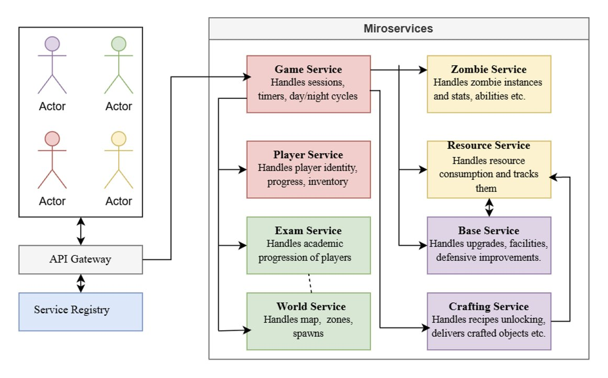

# In Kahoots with the Undead - Communication Contract

This document outlines the communication contracts for the microservices within the **In Kahoots with the Undead** platform — a zombie-survival game set on the FAF campus.

---
## Overview

The platform simulates a campus survival scenario where players gather resources, build up their base, fight off zombies, and pass exams to progress. Each microservice encapsulates a specific domain — player identity, academics, zombies, resources, base management, and crafting. The microservices were  to ensure modularity, independence, and maintainability.

Microservices are implemented using two technologies:

* **Node.js/TypeScript:**  Exam Service, World Service, Zombie Service, Resource Service
* **C#/.NET (ASP.NET Core):** Player Service, Game Service, Base Service, Crafting Service

---
## Team Definition

| Team Member | Services Owned |
|---|---|
| Ceaetchii Andrei | Player Service, Game Service |
| Botnari Maria-Elena | Exam Service, World Service |
| Costin Loredana | Zombie Service, Resource Service |
| Bulat Cristian | Base Service, Crafting Service |

---
## Data Management Strategy

Every service owns a **database** — no service reads or writes another service's tables directly. All cross-service data access happens through the network, using two patterns:

- **Synchronous REST** for data an actor needs immediately to proceed (e.g. Game Service needs zombie stats before it can spawn an encounter). 
- **Asynchronous events** (RabbitMQ) for state changes that other services should eventually react to, but that shouldn't stop the initial request (e.g. World Service unlocking a wing doesn't need to block exam grading).

Two rules apply across every state-changing endpoint that moves resources, items, or currency-like values:

- **Idempotency keys.** Any endpoint that deducts something (`POST /api/gather`, `POST /api/spend`, `POST /craft`, trade endpoints) requires an `idempotencyKey`. The receiving service persists a transaction record keyed on it; a repeated call with the same key returns the original result instead of re-applying the effect. This is what makes reconnects and duplicate completion events safe.
- **Sagas for multi-service writes.** Some actions span two databases with no shared transaction (e.g. crafting deducts resources in Resource Service's database *and* adds an item in Player Service's database). These are implemented as a saga: if the second step fails after the first succeeded, the initiating service (Crafting Service) issues a compensating call to undo the first step, rather than leaving the two databases inconsistent.

No service is ever a passive shared datastore for another — every read of another domain's data goes through that domain's own API, never a shared schema or cross-service SQL join.

---
# Technologies & Communication Patterns
---

| Team | Services | Language & Framework | Database | Communication Patterns | Motivation & Trade-offs |
|---|---|---|---|---|---|
| Ceaetchii Andrei | Player Service, Game Service | C# / ASP.NET Core | Player: PostgreSQL; Game: Redis | REST/HTTP + WebSockets + RabbitMQ Events | C# provides strong typing and asynchronous programming. PostgreSQL ensures data integrity and transactions for the Player Service, while Redis is suitable for temporary Game Service state. REST is used for request/response communication, WebSockets for real-time updates, and RabbitMQ for asynchronous cross-service events.|
| Botnari Maria-Elena | Exam Service, World Service | TypeScript (Express) | PostgreSQL | REST + RabbitMQ events | Both services store structured, relational data (exams and attempts for one, rooms and connections for the other), so one language and one database keeps things simple and easy to maintain across both. |
| Costin Loredana | Zombie Service, Resource Service | Node.js/TypeScript (Express) | Zombie: MongoDB; Resource: PostgreSQL | Zombie: REST; Resource: REST, idempotency-key-gated | Node's non-blocking I/O fits both I/O-bound services, which wait on DB calls. MongoDB's flexible schema enables rapid Zombie Service iteration without migrations as ability types expand. The correctness-critical Resource Service uses TypeScript and DB transactions to enforce atomic, idempotent balance updates, so duplicate completion events never double-award resources.|
| Bulat Cristian | Base Service, Crafting Service | C#/.NET (ASP.NET Core) | PostgreSQL |  REST for Base and Crafting Services; RabbitMQ publisher and consumer for both | Both services perform "spend and apply" operations that must not partially succeed. C#'s explicit exception handling and EF Core transactions make atomic, saga-style operations across service calls easier to reason about than a dynamically-typed alternative. Trade-off: more boilerplate than Node for simple CRUD, accepted for the correctness guarantee. |

---
# Architectural Diagram of Microservices Operation



The diagram illustrates the microservices architecture for the **In Kahoots with the Undead** system. Game Service acts as the central service handling the others, making synchronous calls to Player, Exam, World, Zombie, Resource, and Base Service to run a gameplay cycle. Resource Service and Zombie Service never call outward to other microservices. Exam Service and World Service are loosely coupled via an asynchronous `AchievementUnlocked` event, so grading a player's exam doesn't block on procedural map generation. Crafting Service coordinates a saga across Resource Service and Player Service to atomically consume ingredients and deliver crafted items.

---
## **1. Player Service**

Handles global player identity, progression, and inventory.

### **Responsibilities**
- Player accounts: registration, authentication, profile data.
- Friends and online presence.
- XP totals, levels, and progression.
- The player's inventory: consumables (Coffee, Energy Drinks, Davidan sandwiches) and cosmetics.
- Player-to-player trades, including verifying ownership and transferring items atomically.


### **Exposed API Endpoints**

**`POST /api/auth/register`** *(Consumed by Gateway)*

Creates a new player account.

Payload
```json
{ "username": "faf_survivor", "password": "hunter2", "email": "student@faf.md" }
```

Response
```json
{ "player_id": "p_44", "jwt": "<jwt_token>" }
```

**`POST /api/auth/login`** *(Consumed by Gateway)*

Authenticates a player and returns a JWT.

Payload
```json
{ "username": "faf_survivor", "password": "hunter2" }
```

Response
```json
{ "jwt": "<jwt_token>", "player_id": "p_44" }
```

**`GET /api/players/{player_id}`** *(Consumed by Gateway, Game Service)*

Retrieves a player's public profile.

Headers: `Authorization: Bearer <jwt>`

Response
```json
{ "player_id": "p_44", "nickname": "faf_survivor", "level": 7, "xp": 1450, "group": "FAF-211" }
```

**`PATCH /api/players/{player_id}/progression`** *(Consumed by Game Service)*

Updates XP after a gameplay event.

Payload
```json
{ "xpDelta": 50, "reason": "cycle_survived" }
```

Response
```json
{ "player_id": "p_44", "xp": 1500, "level": 7, "leveledUp": false }
```

**`GET /api/players/{player_id}/inventory`** *(Consumed by Gateway)*

Retrieves the player's consumables and cosmetics.

Response
```json
{ "items": [ { "itemId": "coffee", "quantity": 3 }, { "itemId": "cosmetic_cap", "quantity": 1 } ] }
```

**`POST /api/players/{player_id}/inventory/items`** *(Consumed by Crafting Service)*

Delivers a crafted item to the player's inventory.

Payload
```json
{ "itemId": "barricade_kit", "quantity": 1, "source": "craft:recipe_wood_metal" }
```

Response
```json
{ "status": "added", "inventorySnapshot": { "barricade_kit": 1 } }
```

**`POST /api/players/{player_id}/achievements`** *(Internal handler, triggered by the `AchievementUnlocked` event)*

Grants an achievement directly (also usable by development team for testing).

Payload
```json
{ "achievementId": "achievementSurvivedMathematics", "grantedBy": "exam:mathematics_complete" }
```

Response
```json
{ "status": "granted" }
```

**`POST /api/trades`** *(Consumed by Gateway)*

Initiates an atomic trade between two players. Verifies both parties own the offered items before committing.

Payload
```json
{
  "idempotencyKey": "trade_772",
  "fromPlayerId": "p_44",
  "toPlayerId": "p_77",
  "offer": [ { "itemId": "coffee", "qty": 2 } ],
  "request": [ { "itemId": "sandwich", "qty": 1 } ]
}
```

Success Response (200 OK)
```json
{ "status": "completed", "tradeId": "trade_772" }
```

Error Response (409 Conflict)
```json
{ "status": "rejected", "reason": "insufficient_items" }
```

### **Message Queue Events**

**SUBSCRIBE `ExamPassed`** *(Published by Exam Service)* — awards the XP reported by an exam attempt.

**SUBSCRIBE `CourseCompleted`** *(Published by Exam Service)* — recorded on the player's progress log.

**SUBSCRIBE `AchievementUnlocked`** *(Published by Exam Service)* — awards the achievement and its XP.

---

## **2. Game Service**

The central real-time gameplay service. Manages sessions, the day/night cycle, timers, and timed player actions.

### **Responsibilities**
- Game sessions/lobbies and session timers.
- The day/night cycle state.
- Timed actions in progress: chopping, scavenging, clearing rooms, barricading, upgrading.
- Live WebSocket delivery of action progress and cycle events to clients.

### **Consumed API Endpoints**

- `POST /api/zombies/spawn`, `POST /api/zombies/{id}/special-action` *(Zombie Service)* — spawn encounters, trigger professor/tourist actions.
- `GET /world/rooms`, `GET /world/rooms/{id}/spawnPoints` *(World Service)* — determine what's available in the current zone.
- `POST /exams/start`, `POST /exams/{attemptId}/submit`, `POST /exams/{attemptId}/abandon` *(Exam Service)* — run exam encounters.
- `POST /api/gather` *(Resource Service)* — apply a completed gathering action.
- `POST /api/base/{playerId}/barricade`, `POST /api/base/{playerId}/facilities` *(Base Service)* — trigger base actions.
- `PATCH /api/players/{playerId}/progression` *(Player Service)* — award XP after a cycle.

### **Exposed API Endpoints**

**`POST /api/sessions/{session_id}/actions`** *(Consumed by Gateway)*

Starts a timed player action.

Payload
```json
{ "playerId": "p_44", "actionType": "scavenge", "targetNodeId": "node_7", "durationSeconds": 300 }
```

Response
```json
{ "actionId": "act_991", "idempotencyKey": "gather_p44_node7_20260908T1200", "status": "in_progress" }
```

**WebSocket Connection**

`wss://api.game/ws/sessions/{session_id}?token=<JWT>` — real-time action progress and cycle events.

**Server → Client Events**
- `action_progress`: `{"type":"action_progress","actionId":"act_991","percent":40}`
- `action_completed`: `{"type":"action_completed","actionId":"act_991","result":{"food":12}}`
- `cycle_changed`: `{"type":"cycle_changed","cycle":"night","zone":"zone_12"}`
- `zombie_encounter`: `{"type":"zombie_encounter","zombieInstanceId":"z_991","zombieType":"professor"}`

### **Message Queue Events**

**SUBSCRIBE `ExamFailed`** *(Published by Exam Service)* — notifies the client of a failed exam attempt.

**SUBSCRIBE `ZoneUnlocked`** *(Published by World Service)* — relayed to clients over WebSocket.

---

## **3. Exam Service**

Responsible for the academic progression of players.

### **Responsibilities**
- Every exam offered in the game, across all fifteen university courses, including questions, answer options and passing threshold.
- Every attempt a player makes, including submitted answers, grade and status.
- The six achievements tied to completing course categories, including their unlock conditions and effects.
- A player's progress per course and per category.

### **Exposed API Endpoints**

**`POST /exams`** *(Consumed by development team for content seeding)*

Creates a new exam definition, including its questions and correct answers.

Payload
```json
{
  "courseCategory": "mathematics",
  "examId": "discreteMathematicsExam",
  "courseName": "Discrete Mathematics",
  "questions": [
    { "text": "Which of the following is a valid proposition?", "options": ["2 plus 2", "It is raining today", "Close the door", "Blue"], "correctOptionId": 1 }
  ]
}
```

Response
```json
{ "examId": "discreteMathematicsExam", "created": true }
```

**`GET /exams/course/{courseCategory}`** *(Consumed by development team, Gateway)*

Lists the exams that exist for a given course category.

Response
```json
{ "courseCategory": "mathematics", "exams": [ { "examId": "discreteMathematicsExam", "courseName": "Discrete Mathematics" }, { "examId": "calculus2Exam", "courseName": "Calculus 2" } ] }
```

**`GET /exams/{examId}`** *(Consumed by Game Service, Gateway)*

Retrieves an exam's questions and options for a player, without exposing the correct answers.

Response
```json
{ "examId": "discreteMathematicsExam", "courseCategory": "mathematics", "courseName": "Discrete Mathematics", "questions": [ { "id": "q1", "text": "Which of the following is a valid proposition?", "options": ["2 plus 2", "It is raining today", "Close the door", "Blue"] } ] }
```

**`PUT /exams/{examId}`** *(Consumed by development team)*

Updates an existing exam's questions or passing threshold.

Payload
```json
{ "passingThreshold": 60, "questions": [ { "text": "Updated question text", "options": ["Option A", "Option B", "Option C", "Option D"], "correctOptionId": 2 } ] }
```

Response
```json
{ "updated": true }
```

**`DELETE /exams/{examId}`** *(Consumed by development team)*

Removes an exam definition that is no longer needed.

Response
```json
{ "deleted": true }
```

**`POST /exams/start`** *(Consumed by Game Service)*

Begins a new attempt for a player who encountered a Professor Zombie. Rejects the request if the player already has an attempt in progress or is under a retry cooldown for this exam.

Payload
```json
{ "playerId": "player_123", "examId": "discreteMathematicsExam", "zombieEncounterId": "encounter_789" }
```

Response
```json
{ "attemptId": "attempt_456", "examId": "discreteMathematicsExam", "questions": [ { "id": "q1", "text": "Which of the following is a valid proposition?", "options": ["2 plus 2", "It is raining today", "Close the door", "Blue"] } ] }
```

**`POST /exams/{attemptId}/submit`** *(Consumed by Game Service)*

Records submitted answers, grades the attempt, determines pass or fail, and evaluates whether an achievement is now satisfied.

Payload
```json
{ "answers": [ { "questionId": "q1", "answer": 1 } ] }
```

Response
```json
{ "passed": true, "grade": 70, "correctCount": 7, "totalQuestions": 10, "achievementsUnlocked": ["achievementSurvivedMathematics"] }
```

**`POST /exams/{attemptId}/abandon`** *(Consumed by Game Service)*

Marks an attempt as abandoned, called when a player disconnects or leaves the encounter before submitting.

Payload
```json
{ "reason": "disconnected" }
```

Response
```json
{ "abandoned": true }
```

**`GET /exams/{attemptId}`** *(Consumed by Game Service, Gateway)*

Retrieves the current status and result of a specific attempt.

Response
```json
{ "attemptId": "attempt_456", "playerId": "player_123", "examId": "discreteMathematicsExam", "status": "passed", "grade": 70 }
```

**`GET /exams/{attemptId}/retryEligibility`** *(Consumed by Game Service)*

Reports whether the player can retry the exam tied to this attempt.

Response
```json
{ "canRetry": false, "availableAt": "2026-09-08T10:35:00Z" }
```

**`GET /players/{playerId}/progress`** *(Consumed by Gateway, Player Service)*

Reports the player's status for every course and every category.

Response
```json
{ "playerId": "player_123", "categories": [ { "courseCategory": "mathematics", "status": "in_progress", "exams": [ { "examId": "discreteMathematicsExam", "status": "passed" }, { "examId": "calculus2Exam", "status": "not_started" } ] } ] }
```

**`GET /players/{playerId}/attempts`** *(Consumed by Gateway)*

Reports the full history of a player's exam attempts.

Response
```json
{ "attempts": [ { "attemptId": "attempt_456", "examId": "discreteMathematicsExam", "courseCategory": "mathematics", "status": "passed", "grade": 70, "timestamp": "2026-09-08T10:30:00Z" } ] }
```

**`GET /players/{playerId}/achievements`** *(Consumed by Gateway, Player Service)*

Reports which achievements a player has unlocked and when.

Response
```json
{ "achievements": [ { "achievementId": "achievementSurvivedMathematics", "fullAchievementName": "Achievement, Survived Mathematics", "unlockedAt": "2026-09-08T10:30:00Z" } ] }
```

**`POST /achievements`** *(Consumed by development team)*

Defines or updates an achievement's unlock condition and effect.

Payload
```json
{ "achievementId": "achievementSurvivedMathematics", "fullAchievementName": "Achievement, Survived Mathematics", "description": "Awarded for passing all six Mathematics exams", "condition": "allExamsPassed:mathematics", "effect": "unlockZone:mathematicsWing" }
```

Response
```json
{ "achievementId": "achievementSurvivedMathematics", "created": true }
```

### **Message Queue Events**

**PUBLISH `ExamPassed`** *(Consumed by Player Service)*
```json
{ "playerId": "player_123", "courseCategory": "mathematics", "examId": "discreteMathematicsExam", "attemptId": "attempt_456", "grade": 70, "xpAwarded": 100, "timestamp": "2026-09-08T10:30:00Z" }
```

**PUBLISH `ExamFailed`** *(Consumed by Game Service)*
```json
{ "playerId": "player_123", "courseCategory": "mathematics", "examId": "discreteMathematicsExam", "attemptId": "attempt_457", "timestamp": "2026-09-08T10:40:00Z" }
```

**PUBLISH `CourseCompleted`** *(Consumed by Player Service)*
```json
{ "playerId": "player_123", "courseCategory": "mathematics", "timestamp": "2026-09-08T10:45:00Z" }
```

**PUBLISH `AchievementUnlocked`** *(Consumed by World Service, Player Service)*
```json
{ "playerId": "player_123", "achievementId": "achievementSurvivedMathematics", "fullAchievementName": "Achievement, Survived Mathematics", "xpAwarded": 500, "timestamp": "2026-09-08T10:45:00Z" }
```

---

## **4. World Service**

Owns the persistent physical state of the university.

### **Responsibilities**
- Every zone, every room within each zone, the connections between rooms.
- The type of resource each room produces.
- Every zombie spawn point, including which zombie category is allowed at each.
- Which zones are currently unlocked.

### **Exposed API Endpoints**

**`GET /world/map`** *(Consumed by Game Service, Gateway)*

Returns the full list of zones and their unlocked status.

Response
```json
{ "zones": [ { "zoneId": "zoneZero", "name": "Technical University of Moldova Main Campus", "unlocked": true }, { "zoneId": "mathematicsWing", "name": "Mathematics Wing", "unlocked": false } ] }
```

**`GET /world/zones/{zoneId}`** *(Consumed by Game Service, Gateway)*

Returns the details of a single zone, including the rooms it contains.

Response
```json
{ "zoneId": "mathematicsWing", "name": "Mathematics Wing", "unlocked": false, "rooms": ["physicsLaboratory", "mathematicsWingLibrary", "mathematicsWingCanteen"] }
```

**`GET /world/rooms`** *(Consumed by Game Service)*

Returns the list of rooms, optionally filtered by zone and unlocked status.

Query Parameters: `zoneId`, `unlockedOnly`

Response
```json
{ "rooms": [ { "roomId": "mathematicsExamHall", "fullRoomName": "Mathematics Exam Hall", "type": "classroom", "zoneId": "zoneZero", "connectsTo": ["mainCorridor"] } ] }
```

**`GET /world/rooms/{roomId}`** *(Consumed by Game Service)*

Returns the full detail of a single room.

Response
```json
{ "roomId": "mathematicsExamHall", "fullRoomName": "Mathematics Exam Hall", "type": "classroom", "zoneId": "zoneZero", "connectsTo": ["mainCorridor"] }
```

**`GET /world/rooms/{roomId}/connections`** *(Consumed by Game Service)*

Returns the list of rooms directly reachable from a given room.

Response
```json
{ "roomId": "mathematicsExamHall", "connections": ["mainCorridor"] }
```

**`GET /world/rooms/{roomId}/resourceNode`** *(Consumed by Game Service, Resource Service)*

Returns the resource type a given room produces.

Response
```json
{ "roomId": "physicsLaboratory", "resourceType": "metal scraps" }
```

**`GET /world/rooms/{roomId}/spawnPoints`** *(Consumed by Game Service)*

Returns the spawn points available in a room and the zombie category allowed at each.

Response
```json
{ "roomId": "mathematicsExamHall", "spawnPoints": [ { "spawnPointId": "mathematicsExamHallSpawnOne", "coordinates": { "x": 4, "y": 2 }, "zombieCategoryAllowed": "professor", "tiedCourseCategory": "mathematics" } ] }
```

**`POST /world/zones/unlock`** *(Internal handler, triggered by the `AchievementUnlocked` event; also usable by development team for testing)*

Unlocks a zone according to the mapping between an achievement and its matching zone. Checks the zone's unlocked flag first so the same zone is never unlocked twice.

Payload
```json
{ "achievementId": "achievementSurvivedMathematics", "playerId": "player_123" }
```

Response
```json
{ "zoneId": "mathematicsWing", "roomsAdded": ["physicsLaboratory", "mathematicsWingLibrary", "mathematicsWingCanteen"] }
```

**`GET /world/zones/{zoneId}/status`** *(Consumed by Gateway, Game Service)*

Reports whether a specific zone is currently unlocked and when it was unlocked.

Response
```json
{ "unlocked": true, "unlockedAt": "2026-09-08T10:45:00Z" }
```

**`POST /world/roomTemplates`** *(Consumed by development team)*

Defines a reusable room template, used when generating a wing zone.

Payload
```json
{ "templateId": "standardWingTemplate", "rooms": [ { "type": "laboratory", "resourceType": "metal scraps" }, { "type": "library", "resourceType": "paper" }, { "type": "canteen", "resourceType": "food" } ] }
```

**`GET /world/roomTemplates`** *(Consumed by development team)*

Lists the templates currently defined.

Response
```json
{ "templates": ["standardWingTemplate", "extendedWingTemplate"] }
```

### **Message Queue Events**

**SUBSCRIBE `AchievementUnlocked`** *(Published by Exam Service)*
```json
{ "playerId": "player_123", "achievementId": "achievementSurvivedMathematics", "fullAchievementName": "Achievement, Survived Mathematics", "xpAwarded": 500, "timestamp": "2026-09-08T10:45:00Z" }
```

**PUBLISH `ZoneUnlocked`** *(Consumed by Game Service)*
```json
{ "zoneId": "mathematicsWing", "roomsAdded": ["physicsLaboratory", "mathematicsWingLibrary", "mathematicsWingCanteen"], "timestamp": "2026-09-08T10:45:00Z" }
```
---

## **5. Zombie Service**

Owns the persistent definitions and short-lived instance state of zombies.

### **Responsibilities**
- Zombie type definitions: stats, sprites, behavior configuration, special abilities.
- Two major categories — Professor Zombies (initiate exams) and Tourist Zombies (roam, steal resources/XP). (other categories will be discussed)
- Short-lived zombie instance state during a game cycle (health, position reference, status).

### **Exposed API Endpoints**

**`GET /api/zombie-types?category=professor|tourist`** *(Consumed by Game Service)*

Returns zombie type definitions, optionally filtered by category.

Response
```json
[ { "typeId": "prof_calc", "category": "professor", "baseHealth": 40, "attackStrength": 5, "moveSpeed": 1.0, "perceptionRadius": 6, "specialAbility": "initiate_exam" } ]
```

**`POST /api/zombie-types`** *(Consumed by development team, Admin only)*

Defines a new zombie variant.

Payload
```json
{ "category": "tourist", "name": "Backpacker Horde", "baseHealth": 20, "attackStrength": 2, "moveSpeed": 1.8, "perceptionRadius": 10, "specialAbility": "steal_resource" }
```

**`POST /api/zombies/spawn`** *(Consumed by Game Service)*

Instantiates zombies at cycle start.

Payload
```json
{ "cycleId": "cyc_884", "worldZoneId": "zone_12", "spawnCount": 5, "typeWeights": { "professor": 0.3, "tourist": 0.7 } }
```

Response
```json
{ "zombies": [ { "instanceId": "z_991", "typeId": "prof_calc", "health": 40, "spawnPoint": "node_7" } ] }
```

**`POST /api/zombies/{instance_id}/special-action`** *(Consumed by Game Service)*

Triggers a professor exam-initiation flag or a tourist steal flag, returned to Game Service.

Payload
```json
{ "targetPlayerId": "p_44" }
```

Response
```json
{ "actionType": "steal_resource", "targetPlayerId": "p_44", "suggestedAmount": { "food": 5 } }
```

---

## **6. Resource Service**

Owns the university's resource economy independently from the physical map.

### **Responsibilities**
- Resource type definitions (wood, metal scraps, paper, food) and their rules.
- Player resource inventories/balances.
- Resource node state (how much is available at a given gatherable location).
- The full transaction/idempotency log for every resource change.

### **Consumed API Endpoints**

- `GET /world/rooms/{roomId}/resourceNode` *(World Service)* — determines what resource type a node produces when initializing or validating a node.

### **Exposed API Endpoints**

**`GET /api/inventory/{player_id}`** *(Consumed by Gateway, Base Service, Crafting Service)*

Returns a player's current resource balances.

Response
```json
{ "playerId": "p_44", "resources": { "wood": 10, "metal": 4, "paper": 6, "food": 42 } }
```

**`POST /api/gather`** *(Consumed by Game Service — idempotent)*

Applies a resource change when a timed gathering action completes.

Payload
```json
{ "idempotencyKey": "gather_p44_node7_20260908T1200", "playerId": "p_44", "nodeId": "node_7", "resourceType": "food", "amount": 12 }
```

Success Response (200 OK)
```json
{ "status": "applied", "newBalance": { "food": 42 } }
```

Duplicate Response (200 OK)
```json
{ "status": "already_applied", "newBalance": { "food": 42 } }
```

**`POST /api/spend`** *(Consumed by Base Service, Crafting Service — idempotent)*

Deducts resources for barricading, upgrades, crafting, or feeding Kiki.

Payload
```json
{ "idempotencyKey": "spend_p44_barricade_room9", "playerId": "p_44", "reason": "barricade", "costs": [ { "resourceType": "wood", "amount": 5 }, { "resourceType": "metal", "amount": 2 } ] }
```

Success Response (200 OK)
```json
{ "status": "applied", "newBalance": { "wood": 5, "metal": 2 } }
```

Error Response (402 Payment Required)
```json
{ "status": "rejected_insufficient", "missing": { "wood": 2 } }
```

**`GET /api/nodes/{node_id}`** *(Consumed by Game Service)*

Returns remaining gatherable quantity at a node.

Response
```json
{ "nodeId": "node_7", "resourceType": "food", "quantityAvailable": 30, "respawnRate": "5/hour" }
```

---

## **7. Base Service**

Responsible for the player's survival base, initially represented by the FAF Cab room.

### **Owns**
- Base upgrades, barricades, facilities, and defensive improvements, tracked separately from World Service's campus geography.
- The rooms claimed into the base, their barricade levels, and the aggregate defense rating.
- Unlocked storage capacity and homeroom decorations.
- Kiki's interaction state and reward outcomes.
- The transaction ledger keyed on the caller's idempotency key.

### **Consumed API Endpoints**

- `GET /world/rooms/{roomId}` *(World Service)* — confirms a room exists and its zone is unlocked.
- `POST /api/spend` *(Resource Service)* — deducts resources before applying a barricade, facility upgrade, decoration, or Kiki feeding.
- `POST /api/refund` *(Resource Service)* — returns the resources if the effect cannot be applied.
- `POST /api/players/{player_id}/inventory/items` *(Player Service)* — delivers a Kiki reward to the player's inventory.

Every state-changing endpoint spends first, then applies the effect in one database transaction. If that fails, Base Service refunds the resources rather than leaving the player having paid for nothing.

### **Exposed API Endpoints**

**`GET /api/base/{player_id}`** *(Consumed by Gateway, Game Service)*

Returns the current state of a player's base, including the defense rating used for night raids and the storage capacity used to cap a gather.

Response
```json
{
  "playerId": "p_44",
  "defenseRating": 34,
  "storageCapacity": 250,
  "moraleBonus": 3,
  "rooms": [ { "roomId": "faf_cab", "barricadeLevel": 2 } ],
  "facilities": [ { "facilityType": "storage", "level": 2 } ],
  "decorations": [ { "decorationId": "dec_01", "itemId": "faf_poster" } ],
  "kiki": { "mood": "content", "cooldownUntil": "2026-09-08T22:00:00Z" }
}
```

**`POST /api/base/{player_id}/rooms`** *(Consumed by Gateway — idempotent)*

Claims a campus room into the player's base, after checking with World Service that its zone is unlocked.

Payload
```json
{ "idempotencyKey": "claim_p44_mainCorridor_001", "roomId": "mainCorridor" }
```

Response
```json
{ "roomId": "mainCorridor", "barricadeLevel": 0 }
```

**`POST /api/base/{player_id}/barricade`** *(Consumed by Game Service — idempotent)*

Spends resources via Resource Service, then raises the room's barricade by one level.

Payload
```json
{ "idempotencyKey": "barricade_p44_faf_cab_001", "roomId": "faf_cab" }
```

Success Response (200 OK)
```json
{ "roomId": "faf_cab", "barricadeLevel": 3, "defenseRating": 34, "resourcesSpent": { "wood": 5, "metal": 2 } }
```

Error Response (402 Payment Required)
```json
{ "status": "rejected_insufficient", "missing": { "wood": 2 } }
```

Error Response (500, compensated)
```json
{ "status": "rolled_back", "reason": "effect_not_applied", "resourcesRefunded": true }
```

**`POST /api/base/{player_id}/facilities`** *(Consumed by Game Service — idempotent)*

Unlocks or upgrades a facility by one level; upgrading `storage` also raises the storage capacity.

Payload
```json
{ "idempotencyKey": "facility_p44_storage_001", "facilityType": "storage" }
```

Response
```json
{ "facilityType": "storage", "level": 2, "storageCapacity": 250, "resourcesSpent": { "wood": 8 } }
```

**`POST /api/base/{player_id}/decorations`** *(Consumed by Gateway — idempotent)*

Places a decoration in a claimed room, adding a small morale bonus.

Payload
```json
{ "idempotencyKey": "decorate_p44_faf_poster_001", "itemId": "faf_poster", "roomId": "faf_cab" }
```

Response
```json
{ "decorationId": "dec_01", "moraleBonus": 3, "resourcesSpent": { "paper": 2 } }
```

**`POST /api/base/{player_id}/kiki/interact`** *(Consumed by Gateway — idempotent)*

Feeds Kiki and returns a random booster reward, delivered through Player Service. The reward is rolled once and stored, so a retry returns the same one.

Payload
```json
{ "idempotencyKey": "kiki_p44_001" }
```

Success Response (200 OK)
```json
{ "mood": "happy", "reward": { "itemId": "energy_booster", "quantity": 1 }, "resourcesSpent": { "food": 5 }, "cooldownUntil": "2026-09-08T22:00:00Z" }
```

Error Response (422 Unprocessable Entity)
```json
{ "status": "rejected", "reason": "kiki_on_cooldown" }
```

**`GET /api/base/{player_id}/transactions/{idempotencyKey}`** *(Consumed by Gateway)*

Reports the outcome of a base action, so a client that lost the response can check it instead of retrying blindly.

Response
```json
{ "idempotencyKey": "barricade_p44_faf_cab_001", "action": "barricade", "status": "completed" }
```

### **Message Queue Events**

**PUBLISH `BaseDefenseChanged`** *(Consumed by Game Service)* — reports the new defense rating whenever a barricade or facility changes it.
```json
{ "playerId": "p_44", "defenseRating": 34, "timestamp": "2026-09-08T20:14:00Z" }
```

**SUBSCRIBE `ZoneUnlocked`** *(Published by World Service)* — records the rooms of a newly unlocked wing as claimable.

---

## **8. Crafting Service**

Allows players to combine resources into useful survival equipment.

### **Owns**
- Recipe definitions and unlock conditions: Wood + Metal → Barricade Kit, Paper + Metal → Improvised Weapon, Food + Chemicals → Energy Booster, Metal + Electronics → Zombie Detector, Paper + Wood → Exam Cheat Sheet.
- Which recipes each player has unlocked.
- The craft transaction/saga state for each craft attempt.

### **Consumed API Endpoints**

- `POST /api/spend` *(Resource Service)* — consumes recipe ingredients.
- `POST /api/refund` *(Resource Service)* — returns the ingredients if delivery fails.
- `POST /api/players/{player_id}/inventory/items` *(Player Service)* — delivers the crafted item.
- `GET /api/players/{player_id}` *(Player Service)* — reads the player's level.
- `GET /players/{playerId}/progress` *(Exam Service)* — reads passed exams.
- `GET /world/map` *(World Service)* — reads unlocked zones.

A recipe can be gated on a player level, a passed exam, an unlocked zone, or a discovered resource, which is why this service reads from four others. If delivery fails after the ingredients were consumed, Crafting Service refunds them — this is the saga's rollback path.

### **Exposed API Endpoints**

**`GET /api/recipes`** *(Consumed by Gateway)*

Returns the recipes for a player, each marked unlocked or locked. `playerId` is required, since unlock conditions are evaluated per player.

Query Parameters: `playerId`, `includeLocked`

Response
```json
{
  "playerId": "p_44",
  "recipes": [
    { "recipeId": "recipe_wood_metal", "name": "Barricade Kit", "ingredients": [ { "resourceType": "wood", "amount": 3 }, { "resourceType": "metal", "amount": 1 } ], "output": "barricade_kit", "unlockCondition": null, "unlocked": true },
    { "recipeId": "recipe_metal_electronics", "name": "Zombie Detector", "ingredients": [ { "resourceType": "metal", "amount": 3 }, { "resourceType": "electronics", "amount": 2 } ], "output": "zombie_detector", "unlockCondition": { "type": "playerLevel", "minLevel": 5 }, "unlocked": false }
  ]
}
```

**`GET /api/recipes/{recipeId}/eligibility`** *(Consumed by Gateway)*

Reports whether a player can craft a recipe and, if not, which condition or material is missing.

Query Parameters: `playerId`

Response
```json
{ "recipeId": "recipe_metal_electronics", "unlocked": false, "unsatisfied": [ { "type": "playerLevel", "minLevel": 5, "actual": 3 } ], "missingMaterials": { "electronics": 1 } }
```

**`POST /api/recipes`** *(Consumed by development team for content seeding)*

Defines a new recipe and its unlock condition.

Payload
```json
{ "recipeId": "recipe_food_chemicals", "name": "Energy Booster", "ingredients": [ { "resourceType": "food", "amount": 4 }, { "resourceType": "chemicals", "amount": 1 } ], "output": "energy_booster", "unlockCondition": { "type": "resourceDiscovered", "resourceType": "chemicals" } }
```

Response
```json
{ "recipeId": "recipe_food_chemicals", "created": true }
```

**`POST /api/craft`** *(Consumed by Gateway — idempotent)*

Validates the unlock condition and ingredients, consumes them via Resource Service, and delivers the result via Player Service.

Payload
```json
{ "idempotencyKey": "craft_p44_barricadekit_001", "playerId": "p_44", "recipeId": "recipe_wood_metal" }
```

Success Response (200 OK)
```json
{ "craftId": "craft_881", "status": "completed", "itemDelivered": "barricade_kit" }
```

Error Response (402 Payment Required)
```json
{ "status": "rejected_insufficient_materials", "missing": { "metal": 1 } }
```

Error Response (422 Unprocessable Entity)
```json
{ "status": "rejected", "reason": "recipe_locked" }
```

Error Response (500, compensated)
```json
{ "status": "rolled_back", "reason": "inventory_delivery_failed", "resourcesRefunded": true }
```

**`GET /api/crafts/{craftId}`** *(Consumed by Gateway)*

Reports the state of a craft attempt.

Response
```json
{ "craftId": "craft_881", "playerId": "p_44", "recipeId": "recipe_wood_metal", "status": "completed" }
```

### **Message Queue Events**

**SUBSCRIBE `AchievementUnlocked`** *(Published by Exam Service)* — re-evaluates the player's locked recipes.

**SUBSCRIBE `ZoneUnlocked`** *(Published by World Service)* — re-evaluates recipes gated on an unlocked zone.

**PUBLISH `RecipeUnlocked`** *(Consumed by Game Service)* — reports a recipe that has just become available to a player.
```json
{ "playerId": "p_44", "recipeId": "recipe_metal_electronics", "name": "Zombie Detector", "timestamp": "2026-09-08T20:45:00Z" }
```

---

## Branch Structure

### Main Branches
- **`main`** - Production-ready code, always deployable
- **`development`** - Integration branch for features, staging environment

### Branch Protection Rules
- **Approvals Required**: 1 reviewer minimum
- **Dismiss Stale Reviews**: Enabled (reviews are dismissed when new commits are pushed)
- **Branch must be up to date**: Required before merging

## Branch Naming Convention

We follow a standardized naming pattern for all feature branches:

```
type/short-description-issueID
```

### Branch Types
| Prefix | Purpose | Example |
|--------|---------|---------|
| `feature/` | New functionality | `feature/zombie-spawn-logic-23` |
| `bugfix/` | Bug fixes | `bugfix/resource-double-award-15` |
| `hotfix/` | Critical production fixes | `hotfix/server-crash-18` |
| `refactor/` | Code restructuring | `refactor/resource-transaction-45` |
| `docs/` | Documentation updates | `docs/api-documentation-12` |
| `chore/` | Maintenance tasks | `chore/dependency-updates-8` |

### Naming Guidelines
- Use lowercase letters and hyphens
- Keep descriptions concise but descriptive
- Always include the related issue number
- Use present tense for actions

## Merging Strategy

**Strategy**: Squash and Merge

### Benefits
- Clean, linear commit history
- Combines all commits from a feature branch into a single commit
- Easier to track features and revert if necessary
- Reduces noise in the main branch history

### Process
1. Create feature branch from `development`
2. Make commits with clear, descriptive messages
3. Open Pull Request to `development`
4. After approval, squash and merge
5. Delete feature branch after merge

## Pull Request Requirements

Every Pull Request must include:

### Required Information
- **Clear description** of what changed and why
- **Issue reference** (e.g., "Closes #42", "Fixes #18")
- **List of specific changes** made
- **Testing instructions** or results
- **Screenshots** for UI changes
- **Breaking changes** (if any)

### PR Template

We use the following template (located at `.github/PULL_REQUEST_TEMPLATE.md`):

```markdown
## What does this PR do?
Brief description of the change and its purpose.

## Related Issue
Closes #XX

## Changes Made
- [ ] Added zombie spawn logic
- [ ] Fixed resource double-award bug
- [ ] Updated exam grading tests
- [ ] Improved error handling

## Type of Change
- [ ] Bug fix (non-breaking change that fixes an issue)
- [ ] New feature (non-breaking change that adds functionality)
- [ ] Breaking change (fix or feature that would cause existing functionality to not work as expected)
- [ ] Documentation update

## How to Test
1. Pull this branch: `git checkout feature/branch-name`
2. Install dependencies: `npm install` (Node services) or `dotnet restore` (C# services)
3. Run the service: `npm start` or `dotnet run`
4. Navigate to [specific endpoint/feature]
5. Verify [specific functionality]

## Screenshots (if applicable)
[Attach images for UI changes]

## Checklist
- [ ] My code follows the team's coding standards
- [ ] I have performed a self-review of my code
- [ ] I have commented my code, particularly in hard-to-understand areas
- [ ] I have made corresponding changes to the documentation
- [ ] My changes generate no new warnings
- [ ] I have added tests that prove my fix is effective or that my feature works
- [ ] New and existing unit tests pass locally with my changes
```

## Testing Standards

### Current Requirements
- All new functions should have corresponding tests
- Run existing tests before submitting PR: `npm test` (Node) or `dotnet test` (C#)
- Manual testing steps must be documented in PR
- Critical features (Resource Service transactions, Crafting sagas) require integration testing

### Future Automation
- GitHub Actions will be configured for automatic testing
- All PRs must pass automated tests before merging
- Code coverage reports will be generated

### Testing Requirements
- Unit test coverage minimum: **70%**

## Versioning Strategy

We follow **Semantic Versioning (SemVer)**: `MAJOR.MINOR.PATCH`

### Version Types
- **MAJOR** (e.g., 1.0.0 → 2.0.0): Breaking changes that require user action
- **MINOR** (e.g., 1.0.0 → 1.1.0): New features that are backward compatible
- **PATCH** (e.g., 1.0.0 → 1.0.1): Bug fixes and small improvements

### Release Process
1. Update version in `package.json` (Node) or `.csproj` (C#)
2. Create release notes documenting changes
3. Tag release in GitHub: `git tag v1.0.0`
4. Create GitHub Release with changelog
5. Deploy to staging, then production

### Release Notes Format
```markdown
## [1.2.0] - 2026-09-08

### Added
- Tourist Zombie resource-steal mechanic
- Crafting saga rollback logic

### Changed
- Improved exam grading response time
- Updated Resource Service idempotency handling

### Fixed
- Duplicate resource award on client reconnect
- Base barricade level not persisting

### Security
- Updated dependencies with security patches
```

## Code Review Guidelines

### For Reviewers
- Check code quality and adherence to standards
- Verify functionality matches requirements
- Test the changes locally when possible
- Provide constructive feedback
- Approve only when confident in the changes

### For Authors
- Respond to feedback promptly and professionally
- Make requested changes in separate commits
- Re-request review after addressing feedback
- Keep PRs focused and reasonably sized

## Workflow Summary

1. **Create Issue**: Document the feature/bug with clear requirements
2. **Create Branch**: Use proper naming convention from `development`
3. **Develop**: Make commits with clear, descriptive messages
4. **Test**: Verify functionality and run existing tests
5. **Create PR**: Follow template and provide complete information
6. **Review**: Address feedback and get required approvals
7. **Merge**: Squash and merge to `development`
8. **Deploy**: Regular releases from `development` to `main`

## Tools & Resources

- **GitHub Desktop**: For GUI-based Git operations
- **VS Code / Visual Studio**: Recommended IDEs with Git integration
- **GitHub CLI**: For command-line operations
- **Conventional Commits**: For consistent commit messages

## Team Responsibilities

- **All Team Members**: Follow branching strategy and PR requirements
- **Reviewers**: Provide timely, constructive feedback
- **Project Lead**: Manage releases and resolve conflicts
- **QA**: Test major features before production deployment